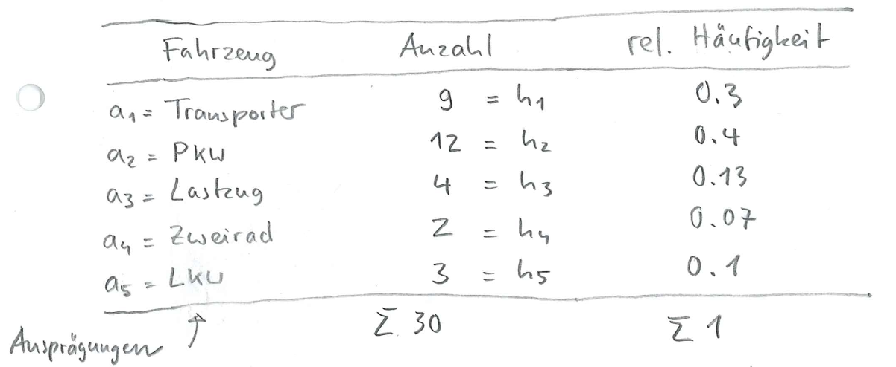
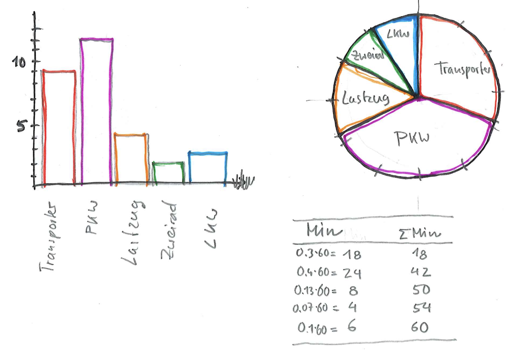
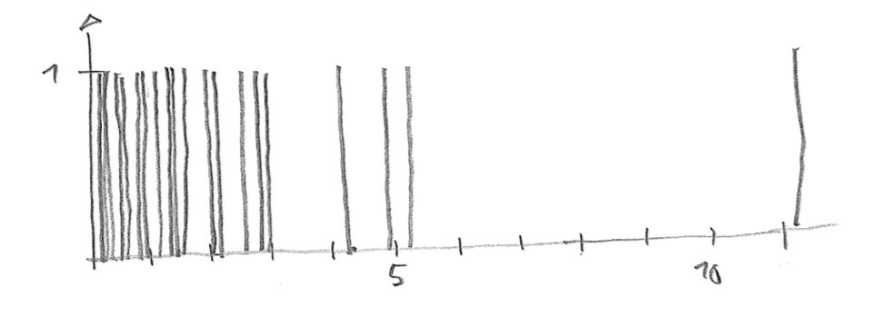
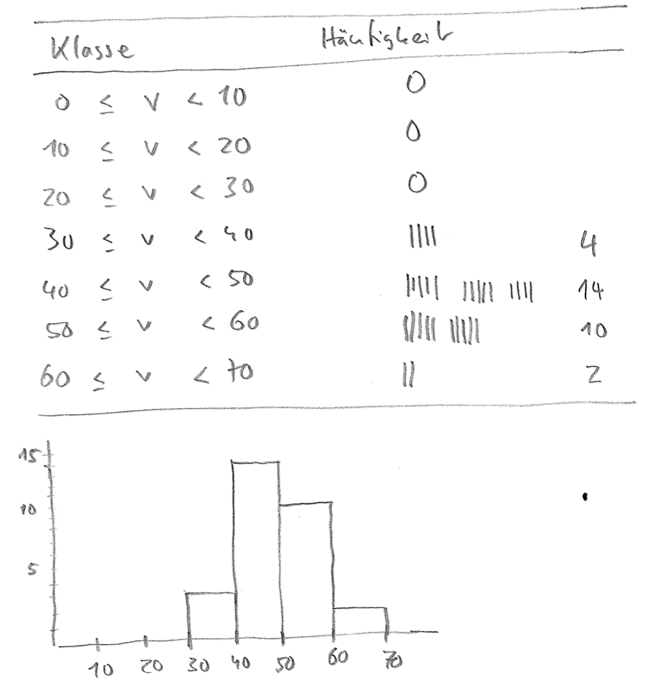

1. Häufigkeitsverteilung und relative Häufigkeiten

   

1. Stellen Sie die absolute Häufigkeitsverteilung in einem Säulen- und einem Kreisdiagramm dar (Skizze)

   

1. Stabdiagramm

   

   Die Darstellung macht keinen Sinn, da die allermeisten Werte nur ein oder zwei Mal vorkommen.

1. Histogramm

   
