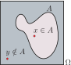
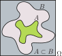
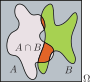
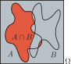
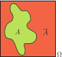
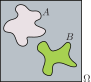
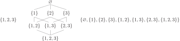

# Grundbegriffe der Wahrscheinlichkeitsrechnung

## Zufallsvorgang und Zufallsexperiment {#sec-zufallsvorgang}

Im Leben hat man es ständig mit Geschehnissen zu tun, deren Ausgang nicht vorhersehbar ist.

::: beispiel
**Beispiele für Zufallsvorgänge:**

a. Sie interessieren sich für Fußball. Wer wird in der laufenden Saison Meister?

a. Sie fahren morgen mit dem ICE von Bochum nach Berlin. Laut Fahrplan soll die Fahrt 3:30 Stunden dauern. Wie lange sind Sie wirklich unterwegs?

a. Sie steigen am Montag um kurz vor acht am Hauptbahnhof in die U35 zur Hochschule. Bekommen Sie einen Sitzplatz?

a. Sie schreiben morgen eine Klausur. Welches Ergebnis erreichen Sie?

a. Sie wollen Ihr 5 Jahre altes Fahrrad (Neupreis 455 Euro) verkaufen. Wie viel bekommen Sie dafür?

a. Bei dem Würfelspiel „Mäxchen" wird mit zwei Würfeln gewürfelt. Der Würfel mit der größeren Augenzahl kommt zuerst. Hier die möglichen Kombinationen

    | 1      | 2      | 3      | 4      | 5      | 6      | 7      | 8      | 9      | 10     | 11     |
    |:------:|:------:|:------:|:------:|:------:|:------:|:------:|:------:|:------:|:------:|:------:|
    | $(3,1)$ | $(3,2)$ | $(4,1)$ | $(4,2)$ | $(4,3)$ | $(5,1)$ | $(5,2)$ | $(5,3)$ | $(5,4)$ | $(6,1)$ | $(6,2)$ |

    | 12     | 13     | 14     | 15     | 16     | 17     | 18     | 19     | 20     | 21     |
    |:------:|:------:|:------:|:------:|:------:|:------:|:------:|:------:|:------:|:------:|
    | $(6,3)$ | $(6,4)$ | $(6,5)$ | $(1,1)$ | $(2,2)$ | $(3,3)$ | $(4,4)$ | $(5,5)$ | $(6,6)$ | $(2,1)$ |

    in der Reihenfolge ihrer Wertigkeit. Wir nummerieren der Einfachheit halber durch und erhalten damit Zahlen zwischen 1 und 21.

a. Sie werfen einen Pfeil auf eine Dartscheibe. Wo steckt der Pfeil und wie viele Punkte zählt Ihr Wurf?
:::

Solche Vorgänge, bei denen zwar prinzipiell klar ist, was im Bereich des Möglichen liegt, der konkrete Ausgang zum aktuellen Zeitpunkt jedoch unbekannt ist, heißen Zufallsvorgänge.

::: {#def-zufallsvorgang}
## Zufallsvorgang

Ein [Zufallsvorgang]{.neuerbegriff} führt zu einem von mehreren möglichen Ergebnissen, die sich jeweils gegeneinander ausschließen. Vor der Durchführung ist zwar grundsätzlich bekannt, womit zu rechnen ist, der konkrete Ausgang kann aber nicht vorhergesagt werden.
:::

Kann ein Zufallsvorgang beliebig oft unter exakt denselben Bedingungen wiederholt werden, dann spricht man von einem [idealen Zufallsexperiment]{.neuerbegriff}. Beispielsweise können wir das Werfen der Würfel beim Mäxchen (Becher gut schütteln!) oder die Ziehung der Lottozahlen als ideale Zufallsexperimente ansehen. Bei sorgfältiger Ausführung ist auch das Wiegen einer Probe oder die Prüfung der Druckfestigkeit eines Betonwürfels als ideales Zufallsexperiment anzusehen.

## Ergebnisse, Ergebnismenge und Ereignisse

Den Ausgang eines Zufallsvorgangs nennen wir [Ergebnis]{.neuerbegriff} und verwenden dafür den Buchstaben $\omega$ (kleines Omega).

Wir haben oben schon festgehalten, dass man sich bei einem Zufallsvorgang vorab klar darüber werden kann, welche Ergebnisse zu erwarten sind. Wir bezeichnen diese Menge aller möglichen Ergebnisse mit dem griechischen Buchstaben $\Omega$ (großes Omega) und sagen dazu [Ergebnisraum]{.neuerbegriff}, [Ergebnismenge]{.neuerbegriff}, [Grundraum]{.neuerbegriff} oder [Stichprobenraum]{.neuerbegriff}. Beachten Sie, dass Menge hier wirklich in einem allgemeinen Sinn verwendet wird, $\Omega$ kann natürlich Zahlen enthalten, aber eben auch Fußballvereine.

::: beispiel
**Beispiele für Ergebnisse und Ergebnismengen:**

a. Am Ende der Saison ist Fortuna Düsseldorf Meister. Dann ist das (eher unwahrscheinliche) Ergebnis $\omega = \text{Fortuna Düsseldorf}$. Die Ergebnismenge enthält natürlich alle Clubs, die in der 1. Bundesliga spielen. In der Saison 2018/19 sind das $\Omega = \{$Hoffenheim, Leverkusen, Bayern München, Dortmund, Mönchengladbach, Frankfurt, Augsburg, Schalke, Fortuna Düsseldorf, Mainz, Hannover, Hertha BSC, Nürnberg, Leipzig, Freiburg, Stuttgart, Wolfsburg, Bremen$\}$.

a. Sie haben Glück und der Zug nach Berlin hat nur $5$ Minuten Verspätung. Dann ist $\omega = 3 \cdot 3600 + (30 + 5) \cdot 60 = 12900\,\mathrm{s}$, wenn wir die Fahrzeit in Sekunden messen. Bei einer genauen Messung der Fahrzeit ist $\Omega = \mathbb{R}_+$, es kommen prinzipiell alle nichtnegativen reellen Zahlen in Frage.

a. Diesmal Pech: Kein Sitzplatz und $\omega = F$. Die Ergebnismenge ist $\Omega = \{W, F\}$, da entweder ein Sitzplatz frei ist ($W$) oder nicht ($F$).

a. Sie haben sich gut vorbereitet und schreiben $\omega = 92\,\%$. Die Ergebnismenge bei einer Klausur enthält bei uns die natürlichen Zahlen zwischen 0 und 100, also $\Omega = \{0, 1, \dots, 100\}$.

a. Leider findet sich niemand, der für Ihr altes Rad mehr als 50 Euro bezahlen möchte. Es ist $\omega = 50$ Euro, wobei wir $\Omega = \{1, 2, \dots, 455\}$ annehmen können (es sei denn, das Rad hat Sammlerwert).

a. Wir müssen hier unterscheiden, ob wir die Würfel oder die Wertigkeit beim Mäxchen betrachten. Wir verwenden zwei unterscheidbare Würfel, würfeln und erhalten mit etwas Glück das Ergebnis $\omega^\mathrm{w} = (2, 1)$ beziehungsweise $\omega^{\mathrm{m}} = 21$.

    Die Ergebnismengen für die beiden Zufallsvorgänge sind
    $$
    \begin{aligned}
    \Omega^{\mathrm{w}} = \{
    & (1,1), (1,2), (1,3), (1,4), (1,5), (1,6), \\
    & (2,1), (2,2), (2,3), (2,4), (2,5), (2,6), \\
    & (3,1), (3,2), (3,3), (3,4), (3,5), (3,6), \\
    & (4,1), (4,2), (4,3), (4,4), (4,5), (4,6), \\
    & (5,1), (5,2), (5,3), (5,4), (5,5), (5,6), \\
    & (6,1), (6,2), (6,3), (6,4), (6,5), (6,6) \}
    \end{aligned}
    $$
    und
    $$
    \Omega^{\mathrm{m}} = \{1, 2, \dots, 21 \}.
    $$
    Dabei ist offensichtlich $|\Omega^{\mathrm{w}}| = 6 \cdot 6 = 36$ und $|\Omega^{\mathrm{m}}| = 21$.

a. Übungsaufgabe.
:::

In vielen Situationen interessiert man sich bei einem Zufallsvorgang nicht dafür, ob ein ganz bestimmtes Ergebnis eingetroffen ist, sondern ob das Ergebnis bestimmten Erwartungen genügt oder bestimmte Eigenschaften hat. Dies lässt sich in der Sprache der Mathematik als Menge formulieren. Eine Teilmenge der Ergebnismenge definiert man als ein Ereignis. Man sagt, dass ein Ereignis eingetroffen ist, wenn das Ergebnis in dieser Menge enthalten ist.

::: beispiel
**Beispiele für Ereignisse:**

a. Es gibt Menschen, die sich nicht für Fußball interessieren, aber eine Abneigung gegen Bayern München hegen. Sie sind schon zufrieden, wenn der Meister in der Menge $A = \{$Hoffenheim, Leverkusen, Dortmund, Mönchengladbach, Frankfurt, Augsburg, Schalke, Fortuna Düsseldorf, Mainz, Hannover, Hertha BSC, Nürnberg, Leipzig, Freiburg, Stuttgart, Wolfsburg, Bremen$\}$ enthalten ist. Dann ist nämlich das Ereignis $A$: „Bayern München ist nicht deutscher Meister" eingetreten.

a. Wenn Sie in Berlin noch einen Anschlusszug nach Frankfurt (Oder) erwischen müssen (Umsteigezeit 10 Minuten), dann hoffen Sie auf das Ereignis
    $$
    A = \{ x \in \mathbb{R}_+ \; | \; x \leq 12900\} = [0, 12900]
    $$
    (der Zug ist höchstens fünf Minuten verspätet).

a. Sie möchten natürlich sitzen und hoffen auf das Ereignis $A = \{W \}$.

a. Um Ihren Studienablauf nicht zu verzögern, möchten Sie auf jeden Fall, dass das Ereignis $A = \{50, 51, \dots, 100\}$ eintritt und Sie die Klausur bestanden haben.

a. Sie möchten auf ein Konzert von Taylor Swift und die Karte kostet 80 Euro. Den Betrag würden Sie gerne aus dem Erlös für das Fahrrad begleichen. Die Menge $A = \{80, 81, \dots, 455\}$ entspricht also dem Ereignis, dass Sie mit dem Verkaufspreis zufrieden sind.

a. Beim Mäxchen sind Sie an der Reihe und es liegt ein Fünferpasch auf dem Tisch. Um das Spiel sicher nicht zu verlieren, müssen Sie das Ereignis
    $$
    A^{\mathrm{w}} = \{(6,6), (1,2), (2,1)\}
    \quad \text{beziehungsweise} \quad
    A^{\mathrm{m}} = \{20, 21\}
    $$
    würfeln.

a. Übungsaufgabe.
:::

Nachdem wir jetzt die Beispiele gesehen haben, können wir den Begriff Zufallsereignis definieren.

::: {#def-zufallsereignis}
## Zufallsereignis

Sei $\Omega$ die Ergebnismenge eines Zufallsvorgangs, dann heißen Teilmengen von $\Omega$ [Zufallsereignisse]{.neuerbegriff} oder kurz [Ereignisse]{.neuerbegriff}. Ereignisse bezeichnen wir mit lateinischen Großbuchstaben.

Spezielle Ereignisse sind

$A = \Omega$

: Sicheres Ereignis. Dieses Ereignis tritt bei jedem Ausgang des Zufallsvorgangs ein.

$A = \varnothing$

: Unmögliches Ereignis. Dieses Ereignis kann nie eintreten, da die leere Menge keine Elemente enthält.

$A = \{\omega\}$

: Elementarereignis. Ein Ereignis, das genau ein Element enthält, nennen wir Elementarereignis.
:::

## Was wir über Mengen wissen müssen

Mengen spielen in der Wahrscheinlichkeitstheorie (wie eigentlich überall in der Mathematik) eine ganz grundlegende Rolle. Wir rufen uns daher nochmals die wichtigsten Zusammenhänge in Erinnerung, siehe dazu auch @fig-mengen.

::: {#fig-mengen layout-ncol=4}
{#fig-mengen-menge}

{#fig-mengen-teilmenge}

{#fig-mengen-schnittmenge}

{#fig-mengen-vereinigungsmenge}

{#fig-mengen-differenzmenge}

{#fig-mengen-komplementaermenge}

{#fig-mengen-disjunkt}

Mengen und Mengenoperationen
:::

Unter einer [Menge]{.neuerbegriff} verstehen wir die Zusammenfassung verschiedener Objekte zu einem Ganzen. Die Objekte einer Menge nennt man [Elemente]{.neuerbegriff}. Ist das Objekt $x$ in der Menge $A$ enthalten, dann ist $x$ ein Element von $A$ und man schreibt $x \in A$. Ist dies nicht der Fall, dann ist $x \notin A$. Mit $|A|$ bezeichnen wir die Anzahl der Elemente in der Menge $A$ (@fig-mengen-menge).

Ist jedes Element aus $A$ auch ein Element von $B$, dann ist $A$ eine [Teilmenge]{.neuerbegriff} von $B$ und man schreibt $A \subset B$ (@fig-mengen-teilmenge). Beachten Sie, dass jede Menge Teilmenge von sich selbst ist, es gilt immer $A \subset A$. Wir definieren weiterhin, dass die leere Menge ebenfalls in jeder Menge enthalten ist, so dass $\varnothing \subset A$ für alle Mengen $A$. Wir treffen keine Unterscheidung zwischen echten und unechten Teilmengen.

Die [Schnittmenge]{.neuerbegriff} $A \cap B$ (@fig-mengen-schnittmenge) enthält alle Objekte, die sowohl in $A$ als auch in $B$ enthalten sind:
$$
A \cap B := \{ x \; | \; x \in A \quad \text{und} \quad x \in B \}.
$$
Es gilt immer $A \subset B \implies A \cap B = A$ und $A \cap \varnothing = \varnothing$.

Die [Vereinigungsmenge]{.neuerbegriff} $A \cup B$ (@fig-mengen-vereinigungsmenge) enthält alle Objekte, die in $A$ oder in $B$ oder in beiden enthalten sind:
$$
A \cup B := \{ x \; | \; x \in A \quad \text{oder} \quad x \in B \}.
$$
Es gilt $A \subset B \implies A \cup B = B$ und $A \cup \varnothing = A$.

Die [Differenzmenge]{.neuerbegriff} $A \setminus B$ (@fig-mengen-differenzmenge) enthält alle Objekte, die in $A$, aber nicht in $B$ enthalten sind:
$$
A \setminus B := \{ x \; | \; x \in A \quad \text{und} \quad x \notin B \}.
$$
Es gilt $A \cap B = \varnothing \implies A \setminus B = A$ sowie $A \subset B \implies A \setminus B = \varnothing$.

Die [Komplementärmenge]{.neuerbegriff} $\overline{A} = \Omega \setminus A$ (@fig-mengen-komplementaermenge) enthält alle Objekte aus $\Omega$, die nicht in $A$ enthalten sind:
$$
\overline{A} := \{ x \; | \; x \in \Omega \quad \text{und} \quad x \notin A \}.
$$
Dabei gilt natürlich $A \cup \overline{A} = \Omega$.

Zwei Mengen heißen [disjunkt]{.neuerbegriff}, wenn es kein Element gibt, das in beiden Mengen enthalten ist (@fig-mengen-disjunkt). Für disjunkte Mengen $A$ und $B$ gilt
$$
A \cap B = \varnothing.
$$

Man kann sich nun überlegen, dass für Mengen die folgenden Rechenregeln gelten.

Kommutativgesetze

: $A \cap B = B \cap A \quad \text{und} \quad A \cup B = B \cup A$

Assoziativgesetze

: $(A \cap B) \cap C = A \cap (B \cap C) \quad \text{und} \quad (A \cup B) \cup C = A \cup (B \cup C)$

Distributivgesetze

: $(A \cup B) \cap C = (A \cap C) \cup (B \cap C) \quad \text{und} \quad (A \cap B) \cup C = (A \cup C) \cap (B \cup C)$

De Morgansche Regeln

: $\overline{(A \cup B)} = \overline{A} \cap \overline{B} \quad \text{und} \quad \overline{(A \cap B)} = \overline{A} \cup \overline{B}$

Komplement von Teilmengen

: $A \subset B \implies \overline{B} \subset \overline{A}$

Differenzmenge

: $A \setminus B = A \cap \overline{B}$

### Abzählbar und überabzählbar unendliche Mengen

Häufig werden wir es mit Mengen zu tun bekommen, die unendlich viele Elemente enthalten. Dies ist zum Beispiel der Fall für unsere Zahlenmengen $\mathbb{N}$ (natürliche Zahlen) und $\mathbb{R}$ (reelle Zahlen). Nun hat Georg Cantor Ende des 19. Jahrhunderts gezeigt, dass die natürlichen Zahlen nicht ausreichen, um die reellen Zahlen durchzunummerieren. Es gibt also gewissermaßen mehr reelle Zahlen als natürliche Zahlen (siehe @fig-diagonalargument). Das ist auf den ersten Blick paradox: Wie kann es sein, dass unendlich viele natürliche Zahlen nicht ausreichen? Cantors Idee war damals unter Mathematikern durchaus umstritten. Heute ist das fest etabliert und man spricht von

1. abzählbar unendlichen Mengen und

1. überabzählbar unendlichen Mengen.

Abzählbar unendliche Mengen sind zum Beispiel die natürlichen, ganzen und rationalen Zahlen $\mathbb{N}, \mathbb{Z}, \mathbb{Q}$ sowie Tupel dieser Zahlen, also zum Beispiel $\mathbb{N}^3$. Überabzählbar unendlich sind die reellen Zahlen $\mathbb{R}$ sowie alle Mengen von Tupeln reeller Zahlen wie der $\mathbb{R}^3$.

::: {#fig-diagonalargument}
$$
\def\dg#1{{\color{red}\mathbf{#1}}}
\begin{array}{r@{\quad}l}
 1 & 0.\dg{6}85568396467716\dots \\
 2 & 0.1\dg{0}8186436351389\dots \\
 3 & 0.23\dg{4}177912119776\dots \\
 4 & 0.624\dg{5}92809239402\dots \\
 5 & 0.7692\dg{4}5804054663\dots \\
 6 & 0.96214\dg{8}501537740\dots \\
 7 & 0.247767\dg{4}76364970\dots \\
 8 & 0.3765222\dg{3}2312709\dots \\
 9 & 0.04757784\dg{1}905877\dots \\
10 & 0.623147336\dg{5}98954\dots \\
11 & 0.4724001856\dg{5}2077\dots \\
12 & 0.89904280169\dg{8}670\dots \\
13 & 0.252734907204\dg{2}85\dots \\
14 & 0.9209416352678\dg{0}9\dots \\
15 & 0.51745549007318\dg{9}\dots \\
\vdots & \qquad \vdots \\
   & 0.715659542669310\dots
\end{array}
$$

Warum die natürlichen Zahlen nicht genügen, um die reellen Zahlen durchzunummerieren
:::

Dass es nicht genügend natürliche Zahlen gibt, um die reellen Zahlen durchzunummerieren, hat Cantor mit seinem zweiten Diagonalargument gezeigt. Wir stellen uns dazu eine Liste unterschiedlicher reeller Zahlen zwischen 0 und 1 vor (@fig-diagonalargument). Jede Zahl hat unendlich viele Stellen (die Punkte rechts) und die Liste der Zahlen ist unendlich lang (die Punkte unten).

Man könnte jetzt denken, dass wir auf diese Art und Weise alle reellen Zahlen zwischen 0 und 1 aufschreiben könnten.

Dass dies nicht klappt, wird klar, wenn wir eine Zahl dadurch bilden, dass wir für die $i$-te Stelle dieser neuen Zahl die $i$-te Stelle der $i$-ten Zahl aus unserer Liste nehmen und abändern. Damit ist die neue Zahl verschieden von allen Zahlen in der Liste und wir sehen, dass die Liste unvollständig ist.

### Potenzmenge

Zu jeder Menge $A$ lässt sich eine neue Menge bilden, die alle Teilmengen von $A$ enthält. Für eine Menge mit drei Elementen sieht das zum Beispiel so aus:

Diese Menge der Teilmengen von $A$ heißt [Potenzmenge]{.neuerbegriff} $\mathcal{P}(A)$ und wird mit einem Schreibschrift-P bezeichnet. Wir definieren die Potenzmenge als die Menge aller Objekte $M$ mit der Eigenschaft „$M$ ist Teilmenge von $A$":
$$
\mathcal{P}(A) = \{ M \; | \; M \subset A \}.
$$
Eine Menge von Mengen nennt man auch [Mengensystem]{.neuerbegriff}.

Enthält $A$ endlich viele Elemente, dann gilt für die Anzahl der Elemente in der Potenzmenge
$$
|\mathcal{P}(A)| = 2^{|A|}.
$$

### Kartesisches Produkt

Wie viele Elemente besitzt die Ergebnismenge, wenn man würfelt, eine Münze wirft (Wappen $W$ oder Zahl $Z$) und dann nochmal würfelt? Systematisch aufgestellt ergibt sich die Ergebnismenge
$$
\begin{aligned}
\Omega = \{
& (1, W, 1), (1, W, 2), \dots, (1, W, 6), (1, Z, 1), (1, Z, 2), \dots, (1, Z, 6), \\
& (2, W, 1), (2, W, 2), \dots, (2, W, 6), (2, Z, 1), (2, Z, 2), \dots, (2, Z, 6), \\
& \qquad \dots \\
& (6, W, 1), (6, W, 2), \dots, (6, W, 6), (6, Z, 1), (6, Z, 2), \dots, (6, Z, 6) \}
\end{aligned}
$$
und damit
$$
|\Omega| = 6 \cdot 2 \cdot 6 = 72.
$$
Warum? Jedes Ergebnis ist ein Tupel von drei Objekten. Für den ersten Eintrag des Tupels gibt es 6 Möglichkeiten, für den zweiten 2 und für den dritten wieder 6. Das Prinzip dahinter wird klar, wenn wir uns verdeutlichen, dass wir $\Omega$ mit den Mengen
$$
M_1 = \{1, 2, 3, 4, 5, 6\}
\quad \text{und} \quad
M_2 = \{W, Z\}
$$
als kartesisches Produkt
$$
\Omega = M_1 \times M_2 \times M_1 = \{ (x_1, x_2, x_3) \;|\; x_1, x_3 \in M_1, x_2 \in M_2\}
$$
darstellen können.

::: {#def-kartesisches-produkt}
## Kartesisches Produkt von Mengen

Entsteht eine Menge $\Omega$ als [kartesisches Produkt]{.neuerbegriff} von Mengen $M_1, M_2, \dots, M_n$
$$
\Omega = M_1 \times M_2 \times \dots \times M_n = \{(x_1, x_2, \dots, x_n) \; | \; x_k \in M_k, k = 1, \dots, n\},
$$
wobei $|M_1| = N_1, |M_2| = N_2, \dots, |M_n| = N_n$, dann ist
$$
|\Omega| = N_1 \cdot N_2 \cdot \ldots \cdot N_n.
$$
:::
