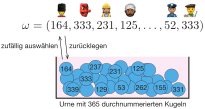
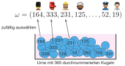
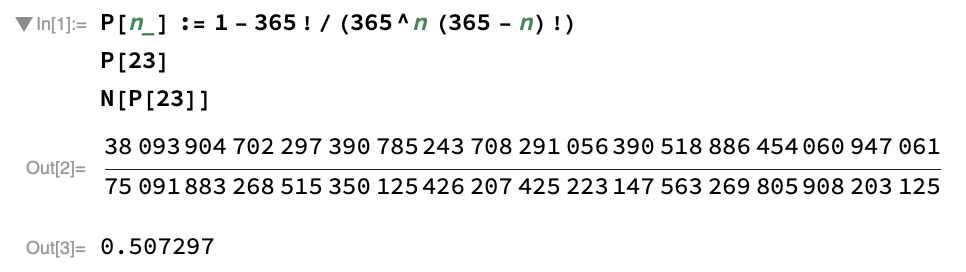
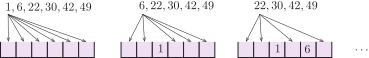

```{r}
#| include: false
source(rprojroot::is_quarto_project$find_file("_bcd-setup.R"))
source("01-daten/kombinatorik.R")
```

# Zufallsstichproben und Kombinatorik

Die Auswahl zufälliger Stichproben ist eine der Aufgaben in der abzählenden Kombinatorik. Hier geht es darum, die Anzahl möglicher Anordnungen oder Auswahlen zu bestimmen. Ein klassisches Gedankenexperiment ist hier das Urnenmodell, auf das sich viele verschiedene Zufallsexperimente zurückführen lassen. Wir gehen dabei davon aus, dass bei jedem Zug alle in der Urne befindlichen Kugeln die gleiche Wahrscheinlichkeit haben, gezogen zu werden.

{width=30%}

Für die Anzahl der möglichen Ziehungen aus der Urne spielt es eine wichtige Rolle, ob die gezogene Kugel wieder in die Urne zurückgelegt wird oder nicht. Weiterhin muss unterschieden werden, ob bei der Ziehung die Reihenfolge eine Rolle spielt oder nicht. Wir werden nun die verschiedenen Fälle an Beispielen kennenlernen.

## Urnenmodell mit Berücksichtigung der Reihenfolge

Das Urnenmodell mit Berücksichtigung der Reihenfolge untersuchen wir am Beispiel der folgenden Fragestellung: Wenn sich $n$ Personen in einem Raum befinden, wie wahrscheinlich ist es, dass mindestens zwei Personen am selben Tag Geburtstag haben?

Wir wollen bei unseren Überlegungen Schaltjahre vernachlässigen und (fälschlicherweise) annehmen, dass Geburtstage gleichmäßig über das ganze Jahr verteilt sind. Damit können wir von einem Laplace-Experiment ausgehen. Der Einfachheit halber nummerieren wir die Tage des Jahres von 1 bis 365 durch.

#### Zufallsvorgang

Unser Zufallsvorgang besteht nun darin, in einem Raum die Geburtstage aller Anwesenden zu notieren. Wir sortieren dabei die Liste der Personen im Raum nach dem Alphabet, so dass die Reihenfolge der Zahlen eindeutig festgelegt ist. Wir erhalten damit als Ergebnis ein Tupel von $n$ Zahlen zwischen 1 und 365. Zum Beispiel entspricht
$$
\omega = (1, 1, \dots, 1)
$$
der kuriosen Situation, dass alle im Raum an Neujahr geboren sind.

#### Ergebnismenge

Die Ergebnismenge besteht dementsprechend aus allen möglichen Zusammenstellungen von Geburtsdaten, also
$$
\Omega = \{(1, 1, \dots, 1), (1, 1, \dots, 2), \dots, (1, 1, \dots, 365), \dots, (365, 365, \dots, 365) \}.
$$
Wie viele Elemente besitzt nun diese Ergebnismenge? Dazu folgende Überlegung: Wir stellen uns eine Urne mit 365 durchnummerierten Kugeln vor. Die Geburtstage werden nun gedanklich dadurch vergeben, dass wir für jeden im Raum eine Kugel aus einer Urne ziehen, den Tag notieren und die Kugel wieder in die Urne zurücklegen.

{width=60%}

Damit gibt es für jeden im Raum 365 mögliche Geburtstage, so dass
$$
|\Omega| = \underbrace{365 \cdot 365 \cdot \ldots \cdot 365}_{n\text{-mal}} = 365^n
$$
die Anzahl der Elemente der Ergebnismenge ist. Allgemein halten wir fest:

**Urnenmodell mit Reihenfolge und mit Zurücklegen:** Aus $N$ nummerierten Kugeln wird $n$-mal nacheinander gezogen, die Zahl notiert und die Kugel zurückgelegt. Dann gibt es
$$
N^n
$$
verschiedene mögliche Ergebnisse.

#### Ereignis „Kein Geburtstag kommt zweimal vor"

Eigentlich interessieren wir uns für das Ereignis $A$, dass mindestens ein Geburtstag mindestens zweifach vertreten ist. Das Problem mit dieser Menge ist, dass sie ziemlich schwer zu beschreiben ist: Es gibt sehr viele Möglichkeiten, wie die betrachtete Situation zustande kommen kann. Viel einfacher haben wir es mit dem Komplementärereignis
$$
\begin{aligned}
\overline{A}
& = \text{„Kein Geburtstag kommt zweimal vor"} \\[1em]
& = \{ (1, 2, \dots, n), (1, 2, \dots, n+1), \dots, (1, 2, \dots, 365), (1, 3, \dots, n+1), \dots \},
\end{aligned}
$$
das dadurch charakterisiert ist, dass in keinem der Tupel doppelte Zahlen vorkommen. In unserem Urnenmodell können wir die Geburtstage nun gedanklich dadurch vergeben, dass wir für jede Person im Raum eine Kugel aus der Urne entnehmen, die Zahl notieren und die Kugel anschließend beiseitelegen.

{width=60%}

Für die erste Kugel gibt es 365 Wahlmöglichkeiten, für die zweite Kugel 364 und so weiter. Insgesamt sind das
$$
\begin{aligned}
|\overline{A}|
& = 365 \cdot 364 \cdot \ldots \cdot (365 - n + 1) \\[1em]
& = 365 \cdot 364 \cdot \ldots \cdot (365 - n + 1)
\cdot
\frac{(365-n) \cdot (365-n-1) \cdot \ldots \cdot 2 \cdot 1}{(365-n) \cdot (365-n-1) \cdot \ldots \cdot 2 \cdot 1}
= \frac{365!}{(365-n)!}
\end{aligned}
$$
verschiedene Möglichkeiten, wie Geburtstage auf $n$ Personen verteilt werden können, ohne dass doppelte Geburtstage vorkommen. Das Ergebnis können wir wieder verallgemeinern.

**Urnenmodell mit Reihenfolge und ohne Zurücklegen:** Aus $N$ nummerierten Kugeln wird $n$-mal nacheinander gezogen, die Zahl notiert und die Kugel beiseitegelegt. Dann gibt es
$$
\frac{N!}{(N-n)!}
$$
verschiedene mögliche Ergebnisse.

::: {#def-fakultaet}
## Fakultät

Für eine natürliche Zahl $n$ ist die [Fakultät]{.neuerbegriff} $n!$ rekursiv definiert als
$$
n! :=
\begin{cases}
n \cdot (n-1)! & \text{für} \quad n > 0 \\
1 & \text{für} \quad n = 0.
\end{cases}
$$
Natürlich können wir auch einfach $n! = n \cdot (n-1) \cdot \ldots \cdot 2 \cdot 1$ schreiben, so wie Sie das wahrscheinlich kennen.
:::

#### Wahrscheinlichkeit gemeinsamer Geburtstage

Für die Frage nach der Wahrscheinlichkeit für mindestens zwei gemeinsame Geburtstage bei $n$ Personen in einem Raum erhalten wir nun das Ergebnis
$$
P(A)
= 1 - P(\overline{A})
= 1 - \frac{|\overline{A}|}{|\Omega|}
= 1 - \frac{365!}{365^n \cdot (365-n)!}.
$$
Handelt es sich beispielsweise um 23 Personen, dann ist es mit
$$
\begin{aligned}
P(A) & = 1 - \frac{365!}{365^{23}(365-23)!} \\[1em]
& = \frac{38093904702297390785243708291056390518886454060947061}{75091883268515350125426207425223147563269805908203125}
= 0.5072\dots
\end{aligned}
$$
wahrscheinlicher, dass zwei Personen gemeinsam feiern könnten (wenn sie das wollen), als dass dies nicht der Fall ist. Die Zusammenstellung für verschiedene Zahlen von Personen zeigt, dass die Wahrscheinlichkeit schnell einen Wert nahe 1 erreicht.

```{r}
#| fig-asp: 0.5

ggplot(data = d_geburtstage, mapping = aes(x = n, y = p)) +
  geom_point(shape = 21, fill = "orange") +
  scale_x_continuous(breaks = c(1, 23, 50, 100)) +
  scale_y_continuous(breaks = c(0, p_geburtstag(23), 1), labels = c("0", "0.507", "1")) +
  labs(x = "Anzahl Personen n", y = "P(A)")
```

```{r}
d_geburtstage |>
  filter(n %in% seq(10, 80, by = 10)) |>
  gt() |>
  fmt_number(columns = p, decimals = 4) |>
  cols_label(p = "P(A)") |>
  tab_options(table.width = pct(30))
```

**Geburtstagsparadoxon:** Die Wahrscheinlichkeit für mindestens einen gemeinsamen Geburtstag bei $n$ Personen ist größer, als viele Menschen das gefühlsmäßig erwarten würden. Man spricht deshalb in diesem Zusammenhang auch vom [Geburtstagsparadoxon]{.neuerbegriff}. Es ist ein Beispiel dafür, dass im Bereich der Wahrscheinlichkeiten viele Sachverhalte nicht intuitiv erfasst werden können.

*Anmerkung:* Die Bestimmung der Wahrscheinlichkeit

{width=60%}

wurde mit dem Programm Mathematica durchgeführt. Taschenrechner können häufig nicht mit solch großen Zahlen rechnen.

## Urnenmodell ohne Berücksichtigung der Reihenfolge

Im Beispiel mit den Geburtstagen war jeder Eintrag in dem Tupel einer Person zugeordnet, die Reihenfolge der Werte in dem Tupel spielt also eine Rolle. In anderen Zusammenhängen ist das nicht der Fall, denken Sie zum Beispiel an die Ziehung der Lottozahlen oder das Würfelspiel „Mäxchen".

### Ziehung ohne Zurücklegen

Beim Lotto 6 aus 49 werden aus unserer Urne mit 49 Kugeln 6 Kugeln entnommen und der Größe nach sortiert. Zum Beispiel führen die Ziehungen
$$
(6, 1, 30, 49, 42, 22), (1, 6, 30, 22, 42, 49), (42, 30, 1, 49, 6, 22), (49, 1, 30, 6, 42, 22)
$$
alle zu demselben Ergebnis
$$
(1, 6, 22, 30, 42, 49).
$$
Für das Lotto 6 aus 49 besitzt die Ergebnismenge daher die Form
$$
\begin{aligned}
\Omega = \{
& (1, 2, 3, 4, 5, 6), (1, 2, 3, 4, 5, 7), \dots, (1, 2, 3, 4, 5, 49), \dots \\
& (2, 3, 4, 5, 6, 7), (2, 3, 4, 5, 6, 8), \dots, (2, 3, 4, 5, 6, 49), \dots \\
& (43, 44, 45, 46, 47, 48), (43, 44, 45, 46, 47, 49), (44, 45, 46, 47, 48, 49) \}.
\end{aligned}
$$
Die Anzahl der möglichen Lottoergebnisse ist somit kleiner als der Wert
$$
\frac{49!}{(49-6)!} = 10068347520,
$$
den wir bei Berücksichtigung der Reihenfolge erhalten hätten.

Die Frage lautet für das Beispiel oben daher: Auf wie viele Arten kann das Ergebnis $(1, 6, 22, 30, 42, 49)$ zustande kommen? Dies können wir uns überlegen, wenn wir uns vorstellen, dass wir die sechs Zahlen auf 6 freie Plätze verteilen sollen.

{width=80%}

Dann gibt es für die erste Zahl 6 freie Plätze, für die zweite 5 und so weiter. Insgesamt gibt es also $6! = 720$ mögliche Anordnungen.

Wir stellen allgemein fest:

**Permutationen:** $N$ unterscheidbare Objekte können in $N!$ verschiedene Reihenfolgen gebracht werden. In der Mathematik sagt man, dass es $N!$ [Permutationen]{.neuerbegriff} gibt.

Wenn beim Lotto nun jedes Ergebnis auf $720$ verschiedene Arten zustande kommen kann, müssen wir den Wert für die Anzahl der Ergebnisse mit Berücksichtigung der Reihenfolge noch durch $720$ teilen und erhalten
$$
|\Omega| = \frac{49! / (49-6)!}{6!} = \frac{10068347520}{720} = 13983816.
$$
Es gibt also knapp 14 Millionen verschiedene Lottoergebnisse. Die Wahrscheinlichkeit für das Ereignis $A$ = „Sechs Richtige im Lotto" beträgt somit
$$
P(A) = \frac{|A|}{|\Omega|} = \frac{1}{13983816},
$$
da $A$ ein Elementarereignis ist (ein einziges Ergebnis entspricht den sechs Richtigen).

**Urnenmodell ohne Reihenfolge und ohne Zurücklegen:** Aus $N$ nummerierten Kugeln wird $n$-mal nacheinander gezogen, die Zahl notiert und die Kugel beiseitegelegt. Danach werden die Zahlen in aufsteigender Reihenfolge sortiert. Dann gibt es
$$
\frac{N!}{(N-n)! \cdot n!}
$$
mögliche Ergebnisse. Dieser Ausdruck kommt so häufig vor, dass er einen eigenen Namen bekommen hat: Es ist der [Binomialkoeffizient]{.neuerbegriff}
$$
\binom{N}{n} := \frac{N!}{(N-n)! \cdot n!},
$$
der als „$N$ über $n$" gelesen wird.

### Ziehung mit Zurücklegen

Beim Würfelspiel Mäxchen gibt es 21 Ergebnisse, die sich aus den 36 verschiedenen Würfen ergeben:
$$
\begin{array}{cccccc}
(1,1) & (1,2) & (1,3) & (1,4) & (1,5) & (1,6) \\
(2,1) & (2,2) & (2,3) & (2,4) & (2,5) & (2,6) \\
(3,1) & (3,2) & (3,3) & (3,4) & (3,5) & (3,6) \\
(4,1) & (4,2) & (4,3) & (4,4) & (4,5) & (4,6) \\
(5,1) & (5,2) & (5,3) & (5,4) & (5,5) & (5,6) \\
(6,1) & (6,2) & (6,3) & (6,4) & (6,5) & (6,6)
\end{array}
\quad \leadsto \quad
\begin{array}{ccc}
(3,1) & (3,2) & (4,1) \\
(4,2) & (4,3) & (5,1) \\
(5,2) & (5,3) & (5,4) \\
(6,1) & (6,2) & (6,3) \\
(6,4) & (6,5) & (1,1) \\
(2,2) & (3,3) & (4,4) \\
(5,5) & (6,6) & (2,1)
\end{array}
$$
Dabei erhalten wir die Zahl $21 = 30/2 + 6$ als Summe von 30 Würfen, die auf jeweils zwei Arten zum selben Ergebnis führen, und den 6 Paschen. Mit zwei Würfeln zu würfeln ist im Prinzip nichts anderes als das zweifache Ziehen aus einer Urne mit sechs nummerierten Kugeln mit Zurücklegen. Allerdings ist dieses Ergebnis nicht ganz so einfach zu verallgemeinern. Wir glauben also ausnahmsweise, dass der folgende Zusammenhang richtig ist.

**Urnenmodell ohne Reihenfolge und mit Zurücklegen:** Aus $N$ nummerierten Kugeln wird $n$-mal nacheinander gezogen, die Zahl notiert und die Kugel zurück in die Urne gelegt. Danach werden die Zahlen in aufsteigender Reihenfolge sortiert. Dann gibt es
$$
\binom{N + n - 1}{n} = \frac{(N + n - 1)!}{(N - 1)! \cdot n!}
$$
mögliche Ergebnisse.

Kontrolle: Für das Mäxchen erhalten wir auf jeden Fall mit
$$
|\Omega| = \binom{6 + 2 - 1}{2} = \binom{7}{2} = \frac{7!}{(7-2)! \cdot 2!} = \frac{5040}{120 \cdot 2} = 21
$$
das bereits bekannte Ergebnis.

## Zusammenfassung

Die Ergebnisse für das Urnenmodell sind hier nochmals zusammengestellt. Die Anzahl der möglichen Stichproben bei einer Ziehung vom Umfang $n$ aus einer Grundgesamtheit mit $N$ unterscheidbaren Objekten beträgt

|                                        | ohne Zurücklegen                  | mit Zurücklegen                |
|:---------------------------------------|:---------------------------------:|:------------------------------:|
| mit Berücksichtigung der Reihenfolge   | $\displaystyle\frac{N!}{(N-n)!}$  | $N^n$                          |
| ohne Berücksichtigung der Reihenfolge  | $\displaystyle\binom{N}{n}$       | $\displaystyle\binom{N+n-1}{n}$ |

Dabei bezeichnet
$$
\binom{N}{n} = \frac{N!}{(N-n)! \cdot n!}
$$
den Binomialkoeffizienten $N$ über $n$.
