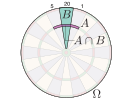
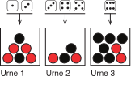
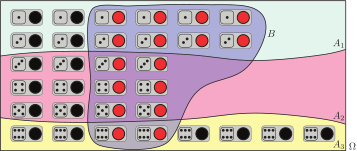
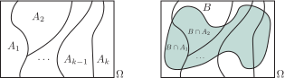

```{r}
#| include: false
source(rprojroot::is_quarto_project$find_file("_bcd-setup.R"))
source("01-daten/rechnen-mit-wahrscheinlichkeiten.R")
```

# Rechnen mit Wahrscheinlichkeiten

## Bedingte Wahrscheinlichkeiten

```{r}
#| fig-width: 4
#| fig-asp: 1
#| out-width: 50%

plot_dartscheibe() +
  geom_point(data = throw_darts(2500), mapping = aes(x = x, y = y), size = 0.1)
```

Wir verwenden das Darts-Spiel als Denkmodell und zählen nur Würfe, die auf der Scheibe landen. Gleichzeitig gehen wir davon aus, dass jede Stelle der Scheibe mit der gleichen Wahrscheinlichkeit getroffen wird. Die Drähte, mit denen die Felder unterteilt werden, vernachlässigen wir. Nach 2500 Würfen könnte sich damit zum Beispiel das oben dargestellte Bild ergeben.

Die Wahrscheinlichkeit dafür, dass ein bestimmtes Feld getroffen wird, entspricht unter diesen Bedingungen genau dem Verhältnis der Fläche des Feldes zur Gesamtfläche der Scheibe. Bezeichnet also $A$ das Ereignis „Pfeil steckt in Triple 20", dann ist
$$
P(A) = \frac{\text{Fläche eines Triple-Feldes}}{\text{Fläche der Scheibe}}
$$
die Wahrscheinlichkeit für die höchste Punktzahl.

Um den Begriff der bedingten Wahrscheinlichkeit einzuführen, definieren wir nun die neuen Ereignisse
$$
\begin{aligned}
A & = \text{„Pfeil steckt in Triple 5, 20 oder 1"}, \\[1ex]
B & = \text{„Pfeil steckt im 20er Feld"}, \\[1ex]
A \cap B & = \text{„Pfeil steckt in Triple 20"}.
\end{aligned}
$$

{width=40%}

Wir fragen uns nun nach der Wahrscheinlichkeit für das Ereignis $A$, wenn wir wissen, dass $B$ eingetreten ist (stellen Sie sich vor, Sie stehen im Nebenzimmer und jemand ruft Ihnen durch die offene Tür „20" zu).

In einer solchen Situation spricht man von einer bedingten Wahrscheinlichkeit: Wie wahrscheinlich ist $A$ unter der Voraussetzung $B$? Dabei gilt die Schreibweise
$$
P(A | B) := \text{Wahrscheinlichkeit für } A \text{ unter der Voraussetzung } B.
$$

Für das Beispiel mit der Dartscheibe ist nun die bedingte Wahrscheinlichkeit $P(A|B)$ wieder gleich der Fläche, die zum Eintreten des Ereignisses $A$ führt, bezogen auf die Gesamtfläche. Da wir nun aber wissen, dass $B$ auf jeden Fall eingetreten ist, entspricht dies der Gesamtfläche und damit ist
$$
\begin{aligned}
P(A|B)
& = \frac{\text{Fläche eines Triple-Feldes}}{\text{Fläche eines ganzen Feldes}} \\[1em]
& = \frac{\text{Fläche eines Triple-Feldes}}{\text{Gesamtfläche}}
\cdot
\frac{\text{Gesamtfläche}}{\text{Fläche eines ganzen Feldes}}.
\end{aligned}
$$
Die Flächenverhältnisse entsprechen dabei genau den Wahrscheinlichkeiten
$$
P(A \cap B) = \frac{\text{Fläche eines Triple-Feldes}}{\text{Gesamtfläche}}
\quad \text{und} \quad
P(B) = \frac{\text{Fläche eines ganzen Feldes}}{\text{Gesamtfläche}},
$$
so dass wir für die bedingte Wahrscheinlichkeit von $A$ unter der Voraussetzung $B$ den Zusammenhang
$$
P(A|B) = \frac{P(A \cap B)}{P(B)}
$$
erhalten. Damit ist die Wahrscheinlichkeit für $A$ unter der Bedingung $B$ gleich der Wahrscheinlichkeit für das gleichzeitige Eintreten von $A$ und $B$ bezogen auf die Wahrscheinlichkeit des Eintretens von $B$.

::: {#def-bedingte-wahrscheinlichkeit}
## Bedingte Wahrscheinlichkeit

Für zwei Ereignisse $A, B \subset \Omega$ mit $P(B) > 0$ ist die [bedingte Wahrscheinlichkeit]{.neuerbegriff}
$$
P(A|B) = \frac{P(A \cap B)}{P(B)}
$$
die Wahrscheinlichkeit für das Eintreten von $A$ unter der Bedingung $B$.
:::

Natürlich können wir uns in dem Beispiel auch umgekehrt nach der Wahrscheinlichkeit dafür fragen, dass der Pfeil im 20er Feld steckt (Ereignis $B$), wenn wir bereits wissen, dass die Punktzahl Triple 5, 20 oder 1 ist (Ereignis $A$). Wir erhalten
$$
\begin{aligned}
P(B|A)
& = \frac{\text{Fläche eines Triple-Feldes}}{\text{Fläche von drei Triple-Feldern}} \\[1em]
& = \frac{\text{Fläche eines Triple-Feldes}}{\text{Gesamtfläche}}
\cdot
\frac{\text{Gesamtfläche}}{\text{Fläche von drei Triple-Feldern}}.
\end{aligned}
$$
Mit der Wahrscheinlichkeit
$$
P(A) = \frac{\text{Fläche von drei Triple-Feldern}}{\text{Gesamtfläche}}
$$
für das Ereignis $A$ ist dann
$$
P(B|A) = \frac{P(A \cap B)}{P(A)}
$$
die bedingte Wahrscheinlichkeit für $B$ unter der Voraussetzung $A$.

Die beiden Formeln für die bedingten Wahrscheinlichkeiten können wir jeweils einfach nach $P(A \cap B)$ umstellen und erhalten den

**Produktsatz:** Seien $A, B \subset \Omega$, dann gilt sowohl
$$
P(A \cap B) = P(A|B) \cdot P(B) \quad \text{für} \quad P(B) > 0
$$
als auch
$$
P(A \cap B) = P(B|A) \cdot P(A) \quad \text{für} \quad P(A) > 0.
$$

Hierzu noch ein Beispiel.

::: beispiel
**Beispiel Mäxchen:** Wie groß ist beim Mäxchen die Wahrscheinlichkeit für
$$
A = \text{„Besser als Zweierpasch"},
$$
wenn wir über die Information verfügen, dass
$$
B = \text{„Eine der beiden gewürfelten Augenzahlen ist kleiner gleich drei"}
$$
eingetreten ist?

Mithilfe der Ergebnismenge
$$
\begin{aligned}
\Omega = \{
& (1,1), (1,2), (1,3), (1,4), (1,5), (1,6), (2,1), (2,2), (2,3), (2,4), (2,5), (2,6), \\
& (3,1), (3,2), (3,3), (3,4), (3,5), (3,6), (4,1), (4,2), (4,3), (4,4), (4,5), (4,6), \\
& (5,1), (5,2), (5,3), (5,4), (5,5), (5,6), (6,1), (6,2), (6,3), (6,4), (6,5), (6,6) \}
\end{aligned}
$$
stellen wir schnell fest, dass
$$
A = \{(1,2), (2,1), (3,3), (4,4), (5,5), (6,6)\}
$$
und
$$
\begin{aligned}
B = \{
& (1,1), (1,2), (1,3), (1,4), (1,5), (1,6), (2,1), (2,2), (2,3), (2,4), (2,5), (2,6), \\
& (3,1), (3,2), (3,3), (3,4), (3,5), (3,6), (4,1), (4,2), (4,3), (5,1), (5,2), (5,3), \\
& (6,1), (6,2), (6,3) \}.
\end{aligned}
$$
Das gemeinsame Eintreten von $A$ und $B$ entspricht der Menge
$$
A \cap B = \{(1,2), (2,1), (3,3)\}.
$$
Da es sich um ein Laplace-Experiment handelt, betragen die Wahrscheinlichkeiten dieser Ereignisse dementsprechend
$$
P(A) = \frac{6}{36} = \frac{1}{6},
\quad
P(B) = \frac{36-9}{36} = \frac{3}{4}
\quad \text{und} \quad
P(A \cap B) = \frac{3}{36} = \frac{1}{12}.
$$
Die gesuchte bedingte Wahrscheinlichkeit ist dann die Wahrscheinlichkeit für das gleichzeitige Eintreten von $A$ und $B$ geteilt durch die Wahrscheinlichkeit von $B$, also
$$
P(A|B) = \frac{P(A \cap B)}{P(B)} = \frac{1}{12} : \frac{3}{4} = \frac{1}{9}.
$$
:::

## Stochastische Unabhängigkeit

::: beispiel
**Beispiel Sally Clark:** Im November 1999 wurde Sally Clark in England für schuldig befunden, ihre beiden Söhne getötet zu haben. Das erste Kind starb 1996 wenige Wochen nach der Geburt, das zweite 1998 unter ähnlichen Umständen. Das Urteil stützte sich im Wesentlichen auf das Gutachten eines Kinderarztes. Dieser hatte, ausgehend von einer Wahrscheinlichkeit von $1/8543$ für das Auftreten des plötzlichen Kindstodes, auf eine Wahrscheinlichkeit von $1 / 8543^2 = 1 / 72982849$ für das zufällige Auftreten von zwei solchen Ereignissen geschlossen. Das Urteil wurde 2003 aufgehoben, nachdem die Königliche Statistische Gesellschaft (Zusammenschluss der Statistiker in Großbritannien) darauf hingewiesen hat, dass die Einschätzung des Kinderarztes keine statistische Basis besitzt und dass die Jury darüber hinaus noch falsche Schlussfolgerungen gezogen hat.

Wir werden uns nun überlegen, wie der Kinderarzt zu seiner Einschätzung gelangt ist und wo in dem gesamten Verfahren die Denkfehler lagen.
:::

Den Begriff der stochastischen Unabhängigkeit diskutieren wir am Beispiel der drei (aus dem Leben gegriffenen) Ereignisse
$$
\begin{aligned}
A & = \text{„Student X schreibt in Klausur Y eine sehr gute Note"}, \\[1em]
B & = \text{„Student X trägt während der Klausur ein grünes T-Shirt"}, \\[1em]
C & = \text{„Student X ist auf Klausur Y sehr gut vorbereitet"}.
\end{aligned}
$$
Die Erfahrung zeigt, dass eine gute Vorbereitung Klausurergebnisse positiv beeinflusst. Es sollte also auf jeden Fall gelten, dass
$$
P(A|C) > P(A)
$$
ist. Demgegenüber haben T-Shirts keinen nachgewiesenen Einfluss auf Klausurergebnisse: Die Farbe spielt keine Rolle und es sollte
$$
P(A|B) = P(A)
$$
gelten. Man sagt, die Ereignisse $A$ und $B$ sind stochastisch unabhängig, während zwischen $A$ und $C$ ein Zusammenhang besteht.

Entsprechend der Definition bedingter Wahrscheinlichkeiten gilt gleichzeitig
$$
P(A|B) = \frac{P(A \cap B)}{P(B)} = P(A)
\quad \text{so dass} \quad
P(A \cap B) = P(A) \cdot P(B),
$$
da $A$ und $B$ stochastisch unabhängig sind. Die Wahrscheinlichkeit dafür, dass Klausur Y für Student X sehr gut ausfällt *und* dass er während der Klausur ein grünes T-Shirt trug, ist gleich dem Produkt der Einzelwahrscheinlichkeiten.

Schließlich ist es auch klar, dass die Farbe des T-Shirts nicht von dem Klausurergebnis abhängt. Daher gilt ebenfalls
$$
P(B|A) = P(B).
$$
Wir haben hier ein Beispiel gesehen, in dem aus der Sachlogik heraus argumentiert wurde, dass sich zwei zufällige Ereignisse nicht gegenseitig beeinflussen.

In der mathematischen Definition der stochastischen Unabhängigkeit wird der Spieß umgedreht: Man sagt, dass zwei Ereignisse stochastisch unabhängig sind, wenn für die Wahrscheinlichkeiten die oben postulierten Zusammenhänge gelten.

::: {#def-stochastische-unabhaengigkeit}
## Stochastische Unabhängigkeit

Zwei Ereignisse $A, B \subset \Omega$ heißen [(stochastisch) unabhängig]{.neuerbegriff}, wenn eine der drei Gleichungen
$$
\begin{aligned}
P(A \cap B) & = P(A) \cdot P(B), \\[1em]
P(A|B) & = P(A) & \text{und} \quad P(B) > 0, \\[1em]
P(B|A) & = P(B) & \text{und} \quad P(A) > 0
\end{aligned}
$$
erfüllt ist. Sind $P(A)$ und $P(B)$ beide größer als 0, dann sind die drei Gleichungen äquivalent. Die erste Gleichung gilt auch für $P(A) = 0$ oder $P(B) = 0$.

*Anmerkung:* In vielen Fällen geht man so vor, dass die Unabhängigkeit postuliert wird und man die Wahrscheinlichkeit $P(A \cap B)$ mithilfe der ersten Gleichung als Produkt $P(A) \cdot P(B)$ berechnet.
:::

### Unabhängigkeit und reale Beeinflussung

Stochastische Abhängigkeit muss begrifflich klar unterschieden werden von realer physikalischer Beeinflussung.

{width=15%}

Als Beispiel dient uns eine Urne mit zwei roten und einer schwarzen Kugel. Wir ziehen nacheinander zwei Kugeln und interessieren uns für die Ereignisse
$$
A = \text{„Die erste Kugel ist rot"}
\quad \text{und} \quad
B = \text{„Die zweite Kugel ist rot"}.
$$
Mit der Ergebnismenge $\Omega = \{ (r, r), (r, s), (s, r) \}$ sind die Wahrscheinlichkeiten
$$
P(A) = 2/3, \quad P(B) = 2/3 \quad \text{und} \quad P(A \cap B) = 1/3.
$$
Entsprechend der Definition der bedingten Wahrscheinlichkeit gilt damit
$$
P(B|A) = \frac{1/3}{2/3} = \frac{1}{2} \neq P(B)
\quad \text{sowie} \quad
P(A|B) = \frac{1/3}{2/3} = \frac{1}{2} \neq P(A).
$$
Während $P(B|A) \neq P(B)$ unmittelbar einleuchtet, ist das Ergebnis $P(A|B) \neq P(A)$ auf den ersten Blick verwirrend: Wie kann es sein, dass die Ziehung der zweiten Kugel einen Einfluss auf die erste Kugel haben soll?

Den Zusammenhang kann man sich an folgendem Gedankenexperiment klarmachen: Sie stehen in einem Zimmer, die Kugeln werden im Nachbarzimmer gezogen. Wird Ihnen nach der Ziehung mitgeteilt, dass die zweite Kugel rot war, dann werden Sie die Wahrscheinlichkeit dafür, dass die erste Kugel auch rot war, anders bewerten, als wenn Sie das nicht wüssten. Für die stochastische Abhängigkeit spielt hier die zeitliche Reihenfolge keine Rolle.

*Anmerkung:* In diesem Beispiel war $P(A|B) = P(B|A)$. Dies ist im Allgemeinen nicht der Fall!

::: beispiel
**Fortsetzung Beispiel Sally Clark:** Wir können nun verstehen, von welchem Gedanken der Kinderarzt in dem Gutachten zum Fall Sally Clark ausgegangen ist. Zunächst setzt er für die beiden Ereignisse
$$
\begin{aligned}
A & = \text{„Das erste Kind stirbt am plötzlichen Kindstod"}, \\[1em]
B & = \text{„Das zweite Kind stirbt am plötzlichen Kindstod"}
\end{aligned}
$$
die Wahrscheinlichkeit $P(A) = P(B) = 1/8543$ an. Weiterhin geht er davon aus, dass die beiden Ereignisse stochastisch unabhängig sind. Dann ist die Wahrscheinlichkeit dafür, dass beide Kinder am plötzlichen Kindstod gestorben sind, gleich
$$
P(A \cap B) = P(A) \cdot P(B) = \frac{1}{8543} \cdot \frac{1}{8543} = \frac{1}{72982849}.
$$
Für das Gericht war dies so unwahrscheinlich, dass von einem Tötungsdelikt der Mutter ausgegangen wurde.

In der Pressemitteilung der Königlichen Statistischen Gesellschaft aus dem Jahr 2001 wurde auf zwei gravierende Probleme in dem Verfahren hingewiesen:

1. Der Ansatz des Gutachters sei statistisch nur dann zulässig, wenn das Auftreten des plötzlichen Kindstodes in einer Familie wirklich statistisch unabhängig ist. Für diese Annahme wurden nicht nur keine empirischen Belege erbracht, vielmehr gibt es gute Gründe, diese Annahme für falsch zu halten. Zum Beispiel kann es durchaus unbekannte genetische Faktoren oder Umwelteinflüsse $C$ geben, die eine Prädisposition für den plötzlichen Kindstod darstellen.

1. Wahrscheinlichkeiten wie $1$ zu $72982849$ werden häufig falsch interpretiert. Berichte in der Presse haben diesen Wert als Wahrscheinlichkeit dafür ausgelegt, dass die Mutter unschuldig war. Dieser Irrtum ist als *Prosecutor's Fallacy* bekannt. Die Jury muss zwischen zwei möglichen Erklärungen für den Tod der Kinder abwägen: Plötzlicher Kindstod oder Mord. Beide Erklärungen sind sehr unwahrscheinlich, aber offensichtlich muss eine davon zutreffen. In einem solchen Fall müssen die Wahrscheinlichkeiten für beide Erklärungen verglichen werden. Man darf nicht von einer kleinen Wahrscheinlichkeit für eine Erklärung darauf schließen, dass die andere Erklärung wahrscheinlicher ist.

Abschließend wird in der Pressemitteilung darauf hingewiesen, dass zwar viele Wissenschaftler statistische Grundkenntnisse besitzen, die Statistik aber doch ein spezialisiertes Gebiet darstellt. Demzufolge sollen Gerichte sicherstellen, dass statistische Beweise nur von ausgewiesenen statistischen Experten vorgelegt werden dürfen.

Auf Grundlage der Intervention der Königlichen Statistischen Gesellschaft wurde das Urteil von Sally Clark revidiert und in einen Freispruch umgewandelt. Sally Clark wurde nach der Haftentlassung depressiv, sie starb 2007 an einer Alkoholvergiftung.
:::

## Totale Wahrscheinlichkeit

Es gibt Situationen, in denen nur Wahrscheinlichkeiten für das Eintreten eines Ereignisses unter bestimmten Bedingungen bekannt sind. Wie kann dann die gesamte Wahrscheinlichkeit bestimmt werden?

::: beispiel
**Beispiel drei Urnen:** Wir betrachten hierzu ein Zufallsexperiment mit drei Urnen.

{width=50%}

Zunächst wird eine Urne nach dem oben dargestellten Schema ausgewürfelt. Danach wird aus dieser Urne eine Kugel gezogen. Welche Wahrscheinlichkeit besitzt das Ereignis
$$
B = \text{„Die Kugel ist rot"}?
$$
Wir sehen sofort, mit welcher Wahrscheinlichkeit die Kugel rot ist, wenn klar ist, aus welcher Urne gezogen werden soll. Wir definieren also die Ereignisse
$$
A_i = \text{„Kugel wird aus Urne } i \text{ gezogen"}, \quad i = 1, \dots, 3
$$
und zählen die bedingten Wahrscheinlichkeiten
$$
P(B|A_1) = \frac{4}{6} = \frac{2}{3},
\quad
P(B|A_2) = \frac{2}{4} = \frac{1}{2}
\quad \text{und} \quad
P(B|A_3) = \frac{2}{8} = \frac{1}{4}
$$
ab. Darüber hinaus ist auch klar, dass
$$
P(A_1) = \frac{2}{6} = \frac{1}{3},
\quad
P(A_2) = \frac{3}{6} = \frac{1}{2}
\quad \text{und} \quad
P(A_3) = \frac{1}{6}
$$
gelten muss.

Wie lässt sich nun aus diesen Werten die Wahrscheinlichkeit $P(B)$ bestimmen? Wir erinnern uns hierzu an den Produktsatz für bedingte Wahrscheinlichkeiten. Dieser sagt uns, dass für beliebige Teilmengen $A, B \subset \Omega$
$$
P(B \cap A) = P(B|A) \cdot P(A)
$$
gilt. Übertragen auf unser Beispiel heißt das
$$
\begin{aligned}
P(B \cap A_1) & = P(B|A_1) \cdot P(A_1) = \frac{2}{3} \cdot \frac{1}{3} = \frac{2}{9}, \\[1em]
P(B \cap A_2) & = P(B|A_2) \cdot P(A_2) = \frac{1}{2} \cdot \frac{1}{2} = \frac{1}{4}, \\[1em]
P(B \cap A_3) & = P(B|A_3) \cdot P(A_3) = \frac{1}{4} \cdot \frac{1}{6} = \frac{1}{24}.
\end{aligned}
$$
Wir müssen es also nur noch schaffen, die gesuchte Wahrscheinlichkeit $P(B)$ durch die Wahrscheinlichkeiten $P(B \cap A_i)$ auszudrücken.

Hierzu schreiben wir den Ergebnisraum $\Omega$ einmal auf und tragen die Ereignisse $B$ und $A_1, A_2$ sowie $A_3$ ein:

{width=60%}

Die Ergebnismenge $\Omega$ teilt sich also in die drei paarweise disjunkten Mengen $A_1, A_2$ und $A_3$ auf:
$$
\Omega = A_1 \cup A_2 \cup A_3
$$
(es wird immer aus einer der drei Urnen gezogen). Dementsprechend gilt auch
$$
B = (B \cap A_1) \cup (B \cap A_2) \cup (B \cap A_3),
$$
wobei $(B \cap A_1), (B \cap A_2)$ und $(B \cap A_3)$ natürlich ebenfalls paarweise disjunkt sind. Daher folgt aus den Rechenregeln für Wahrscheinlichkeiten das gesuchte Ergebnis
$$
\begin{aligned}
P(B)
& = P\left((B \cap A_1) \cup (B \cap A_2) \cup (B \cap A_3)\right) \\[1em]
& = P(B \cap A_1) + P(B \cap A_2) + P(B \cap A_3) \\[1em]
& = \frac{2}{9} + \frac{1}{4} + \frac{1}{24} = \frac{37}{72} = 0.5138\dots
\end{aligned}
$$
:::

Wir verallgemeinern das Beispiel auf eine beliebige disjunkte Zerlegung der Ergebnismenge in Teilmengen $A_1, \dots, A_k \subset \Omega$ mit
$$
\Omega = A_1 \cup A_2 \cup \dots \cup A_k
\quad \text{wobei} \quad
A_i \cap A_j = \varnothing
\quad \text{für alle} \quad
i,j = 1, \dots, k, \quad i \neq j,
$$
vergleiche @fig-totale-wahrscheinlichkeit links. Auf dieser Grundlage können wir jedes Ereignis $B \subset \Omega$ in der Form
$$
B = (B \cap A_1) \cup (B \cap A_2) \cup \dots \cup (B \cap A_k)
$$
darstellen (siehe @fig-totale-wahrscheinlichkeit rechts).

{#fig-totale-wahrscheinlichkeit width=70%}

Für die Wahrscheinlichkeit des Eintretens von $B$ erhalten wir mit den Rechenregeln für Wahrscheinlichkeiten die Summendarstellung
$$
P(B)
= P(B \cap A_1) + P(B \cap A_2) + \dots + P(B \cap A_k)
= \sum_{i=1}^k P(B \cap A_i).
$$
Gleichzeitig sagt uns aber der Produktsatz, dass wir die Wahrscheinlichkeit, dass $B$ und $A_i$ gleichzeitig eintreten, auch mithilfe der bedingten Wahrscheinlichkeit
$$
P(B \cap A_i) = P(B|A_i) \cdot P(A_i)
$$
ausdrücken können. Insgesamt erhalten wir den

**Satz von der totalen Wahrscheinlichkeit:** Sei $A_1, \dots, A_k$ eine disjunkte Zerlegung von $\Omega$, dann gilt für $B \subset \Omega$
$$
P(B) = \sum_{i=1}^k P(B|A_i) \cdot P(A_i).
$$

## Der Satz von Bayes

::: beispiel
**Beispiel HIV-Test:** In den späten 1980er Jahren gab es eine umfassende öffentliche Debatte um das Vorhaben der damaligen Bayerischen Landesregierung, verpflichtende HIV-Tests einzuführen. Hierzu sollte die ELISA-Methode (Enzyme Linked Immunosorbent Assay) als Suchtest verwendet werden. Wir werden uns nun mit den statistischen Fragen befassen, die mit dieser Testmethode verbunden sind.

Die Genauigkeit diagnostischer Testverfahren wird durch die beiden Größen Sensitivität und Spezifität beschrieben. Die [Sensitivität]{.neuerbegriff} gibt an, bei welchem Prozentsatz eine Infektion durch den Test erkannt wird. Demgegenüber bezeichnet die [Spezifität]{.neuerbegriff} die Wahrscheinlichkeit, dass der Test bei einer nicht infizierten Person negativ ausfällt. Eine wichtige Rolle spielt darüber hinaus die Wahrscheinlichkeit, dass eine zufällig ausgewählte Person mit dem HI-Virus infiziert ist.

Wir definieren die Ereignisse
$$
\begin{aligned}
A & = \text{„Die getestete Person ist mit dem HI-Virus infiziert"}, \\[1ex]
B & = \text{„Der HIV-Test ist positiv"}
\end{aligned}
$$
und legen folgende Zahlenwerte [@arens_mathematik_2015] zugrunde:
$$
\begin{aligned}
P(B|A) & = 0.999 & & \text{(Sensitivität, richtig positiv)}, \\[1ex]
P(\overline{B}|\overline{A}) & = 0.995 & & \text{(Spezifität, richtig negativ)}, \\[1ex]
P(A) & = 0.001 & & \text{(Wahrscheinlichkeit einer Infektion)}.
\end{aligned}
$$
Die Frage lautet nun: Mit welcher Wahrscheinlichkeit ist eine Person infiziert, wenn der Test positiv ist? Gesucht ist also der Wert $P(A|B)$.

Wir beginnen mit der bedingten Wahrscheinlichkeit
$$
P(A|B) = \frac{P(A \cap B)}{P(B)}.
$$
Entsprechend dem Produktsatz gilt
$$
P(A \cap B) = P(B|A) \cdot P(A).
$$
Der Satz über die totale Wahrscheinlichkeit liefert für $\Omega = A \cup \overline{A}$
$$
P(B) = P(B|A) \cdot P(A) + P(B|\overline{A}) \cdot P(\overline{A}).
$$
Die beiden Beziehungen werden in die bedingte Wahrscheinlichkeit eingesetzt:
$$
P(A|B) = \frac{P(B|A) \cdot P(A)}{P(B|A) \cdot P(A) + P(B|\overline{A}) \cdot P(\overline{A})}.
$$
Schließlich berechnen wir mit
$$
P(B|\overline{A}) = 1 - P(\overline{B}|\overline{A}) = 1 - 0.995 = 0.005
$$
und
$$
P(\overline{A}) = 1 - P(A) = 1 - 0.001 = 0.999
$$
den überraschenden Wert
$$
P(A|B)
= \frac{0.999 \cdot 0.001}{0.999 \cdot 0.001 + 0.005 \cdot 0.999}
= \frac{0.001}{0.001 + 0.005}
= \frac{1}{6}
\approx 0.167.
$$
Die Wahrscheinlichkeit für eine HIV-Infektion liegt also selbst bei einem positiven Testergebnis bei nicht einmal 17 %. Mehr als 83 % der positiv getesteten Personen würden mit diesem Test unnötig in Verzweiflung gestürzt.

Worin besteht dann der Sinn eines solchen Suchtests? Wir betrachten hierzu die Wahrscheinlichkeit (Übungsaufgabe)
$$
P(\overline{A}|\overline{B}) = 0.999998993\dots
$$
dafür, dass keine Infektion vorliegt, wenn das Testergebnis negativ ist. Hier kann also auf jeden Fall Entwarnung gegeben werden. Ein positives Ergebnis des einfach durchzuführenden ELISA-Suchtests wird in der medizinischen Praxis hingegen immer durch einen aufwändigeren Bestätigungstest abgesichert (Western-Blot-Test).
:::

Im Beispiel haben wir einen Sonderfall des Satzes von Bayes hergeleitet. Wir werden dieses Ergebnis nun verallgemeinern und beginnen mit der Bayes-Formel. Im Beispiel oben hatten wir schon die Beziehungen
$$
P(A|B) = \frac{P(A \cap B)}{P(B)}
\quad \text{und} \quad
P(A \cap B) = P(B|A) \cdot P(A)
$$
verwendet. Einsetzen liefert die

**Bayes-Formel:** Für zwei Ereignisse $A, B$ mit $P(B) > 0$ gilt
$$
P(A | B) = \frac{P(B|A) \cdot P(A)}{P(B)}.
$$

Für den Satz von Bayes legen wir nun eine disjunkte Zerlegung von $\Omega$ in die Teilmengen $A_1, \dots, A_k$ zugrunde. Damit ist
$$
P(B) = \sum_{i=1}^k P(B|A_i) \cdot P(A_i)
$$
(totale Wahrscheinlichkeit). Gleichzeitig gilt die Bayes-Formel natürlich für jede Teilmenge $A_j, \; j = 1, \dots, k$. Dies liefert den

**Satz von Bayes:** Sei $A_1, \dots, A_k$ eine disjunkte Zerlegung von $\Omega$, dann ist
$$
P(A_j | B) = \frac{P(B|A_j) \cdot P(A_j)}{\displaystyle \sum_{i=1}^k P(B|A_i) \cdot P(A_i)},
\quad j = 1, \dots, k.
$$

Anmerkungen:

- Im Satz von Bayes ist der Zusammenhang
    $$
    P(A|B) = \frac{P(B|A) \cdot P(A)}{P(B|A) \cdot P(A) + P(B|\overline{A}) \cdot P(\overline{A})}
    $$
    aus dem Beispiel als Sonderfall enthalten.

- Der Satz von Bayes hat sehr weitreichende Anwendungen, zum Beispiel Spam-Filter für E-Mails und die Beurteilung der Sinnhaftigkeit von medizinischen Massenscreenings.
