```{r}
#| include: false
source(rprojroot::is_quarto_project$find_file("_bcd-setup.R"))
source("01-daten/wahrscheinlichkeit.R")
```

# Wahrscheinlichkeit

Im Alltag denken wir ständig in Begriffen wie:

- Der Wetterbericht sagt für morgen eine Regenwahrscheinlichkeit von 40 % voraus. Das Picknick sage ich nicht ab, aber einen Regenschirm werde ich einpacken.

- Sie glauben, dass Sie für den alten Drahtesel noch mindestens 100 Euro bekommen und bestellen schon mal das Ticket für das Konzert.

- Wahrscheinlich fehlt wieder das Zugpersonal oder es geht bei der Bahn sonst etwas schief und es wird nichts mit dem geplanten Abendessen in Frankfurt (Oder).

Aber auch bei sehr ernsten Themen geht es ähnlich zu:

- Die Autoren der „Deutschen Risikostudie Kernkraftwerke – Phase B" kamen 1989 für das Kernkraftwerk Biblis zum Ergebnis, dass die Wahrscheinlichkeit für eine Kernschmelze pro Reaktor-Betriebsjahr bei 3.6 Millionstel liegt [@deutsche_1990].

Es geht also letztlich darum, die Chance für das Eintreten eines Ereignisses zu bewerten und daraus Entscheidungen für Handlungen abzuleiten. Während Ihre Einschätzung über den Erlös für das Fahrrad eindeutig eine subjektive Einschätzung ist, fußen die Aussagen über das Wetter oder die Reaktorsicherheit auf einer mathematischen Theorie des Zufalls (was natürlich niemanden davor bewahrt, unzutreffende Aussagen daraus abzuleiten).

Die Theorie des Zufalls hat eine lange und recht bewegte Geschichte hinter sich. Einige der wichtigsten Protagonisten sind in @fig-protagonisten zu sehen.

::: {#fig-protagonisten layout="[[37,33,31,32],[63,30,30]]"}
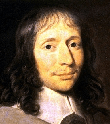{height=42mm}

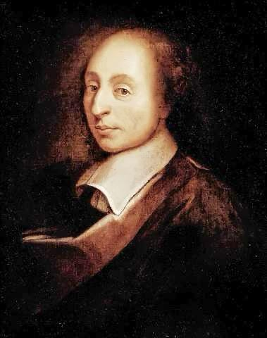{height=42mm}

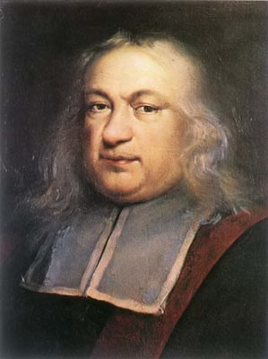{height=42mm}

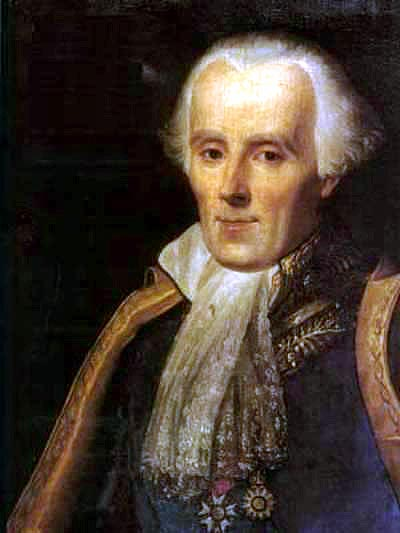{height=42mm}

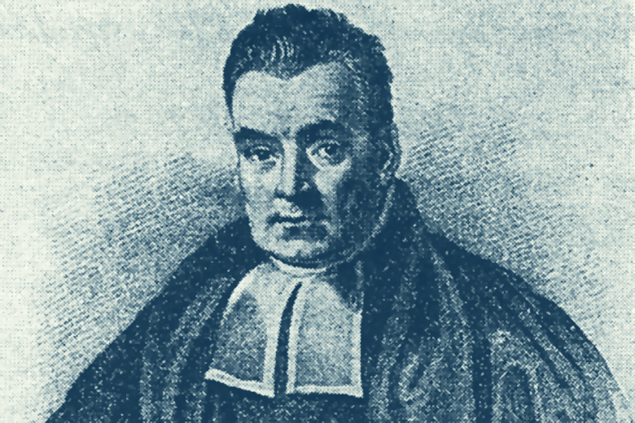{height=42mm}

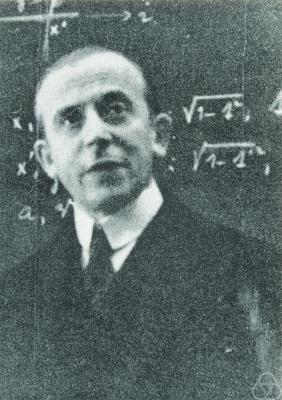{height=42mm}

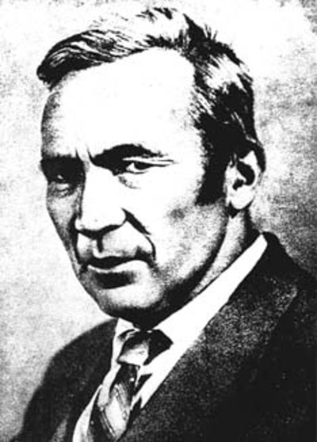{height=42mm}

Wichtige Protagonisten der Wahrscheinlichkeitstheorie
:::

## Klassischer Wahrscheinlichkeitsbegriff

Die Wahrscheinlichkeitsrechnung nahm ihren Anfang, als sich im Jahr 1654 Chevalier de Méré (1607–1684, Schriftsteller, Amateurmathematiker und Spieler) an Blaise Pascal (1623–1662, Mathematiker, Physiker, Literat und christlicher Philosoph) wandte, um ein scheinbares Paradoxon beim Würfelspiel aufzuklären. Daraus entspann sich ein Briefwechsel zwischen Pascal und Pierre de Fermat (1607–1665, Rechtsanwalt und Mathematiker), der heute als erste ernsthafte mathematische Auseinandersetzung mit Wahrscheinlichkeiten gilt.

Im frühen 19. Jahrhundert hat sich dann Pierre-Simon Laplace (1749–1827, Mathematiker, Physiker und Astronom) mit der Wahrscheinlichkeitsrechnung befasst. Nach ihm ist der klassische Wahrscheinlichkeitsbegriff der Mathematik benannt, der insbesondere für Glücksspiele erfolgreich angewendet werden kann.

Die Laplace-Wahrscheinlichkeit ist definiert für eine endliche Menge $\Omega = \{\omega_1, \omega_2, \dots, \omega_N\}$ von $N$ Ergebnissen, die alle mit der gleichen Wahrscheinlichkeit auftreten können. Zum Beispiel ist es vernünftig anzunehmen, dass beim Werfen eines Würfels alle sechs möglichen Ergebnisse gleich wahrscheinlich sind (zumindest solange niemand den Würfel manipuliert hat). Damit ist die Wahrscheinlichkeit des Eintretens jedes Elementarereignisses $\{\omega_i\}$ gleich groß, nämlich genau $1 / N$. Man verwendet für die Wahrscheinlichkeit eines Ereignisses $A$ die Schreibweise $P(A)$ und erhält damit die Wahrscheinlichkeit
$$
P(\{\omega_i\}) = \frac{1}{|\Omega|} = \frac{1}{N}
$$
für jedes Elementarereignis $\{\omega_i\}, \; i = 1, \dots, N$.

::: beispiel
**Beispiel Mäxchen:** Beim Mäxchen liegt $(5,5)$ auf dem Tisch und wir hoffen, dass bei unserem Wurf das Ereignis
$$
\{(6,6), (1,2), (2,1)\}
$$
eintritt. Von den 36 möglichen Ergebnissen führen drei verschiedene Ergebnisse zum Erfolg. Wir addieren die Wahrscheinlichkeiten und erhalten
$$
P(\{(6,6), (1,2), (2,1)\}) = \frac{1}{36} + \frac{1}{36} + \frac{1}{36} = 3 \cdot \frac{1}{36} = \frac{1}{12}.
$$
:::

Für die Wahrscheinlichkeit des Eintretens von $A$ müssen wir also einfach feststellen, wie viele der möglichen Ergebnisse zum Eintreten von $A$ führen, und diesen Wert durch die Anzahl aller möglichen Ergebnisse dividieren:
$$
P(A) = \frac{\text{Anzahl der Ergebnisse in } A}{\text{Anzahl aller möglichen Ergebnisse}}.
$$
Dies führt uns zur Definition der Laplace-Wahrscheinlichkeit.

::: {#def-laplace-wahrscheinlichkeit}
## Laplace-Wahrscheinlichkeit

Sind bei einem Zufallsvorgang mit einer endlichen Ergebnismenge $\Omega = \{\omega_1, \omega_2, \dots, \omega_N\}$ alle $N$ Elementarereignisse gleich wahrscheinlich, dann ist
$$
P(A) = \frac{|A|}{|\Omega|} = \frac{M}{N}
$$
die [Laplace-Wahrscheinlichkeit]{.neuerbegriff} für das Eintreten des Ereignisses $A$. Dabei ist $M$ die Anzahl der Elemente in $A$.
:::

## Wahrscheinlichkeit als Grenzwert relativer Häufigkeiten

Natürlich kann nicht immer davon ausgegangen werden, dass alle Elementarereignisse gleich wahrscheinlich sind. Zum Beispiel legt die in @fig-reisszwecken dargestellte Versuchsreihe mit in die Luft geworfenen Reißzwecken nahe, dass für die Ergebnismenge
$$
\Omega = \{ O, U \} \quad \text{eben nicht} \quad P(\{O\}) = P(\{U\})
$$
gilt und wir daher mit der Laplace-Wahrscheinlichkeit nicht weiterkommen. Dabei steht $O$ 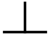{height=1em} für eine Reißzwecke, deren Spitze nach oben zeigt, und $U$ {height=1em} für eine Reißzwecke, deren Spitze auf dem Boden liegt.

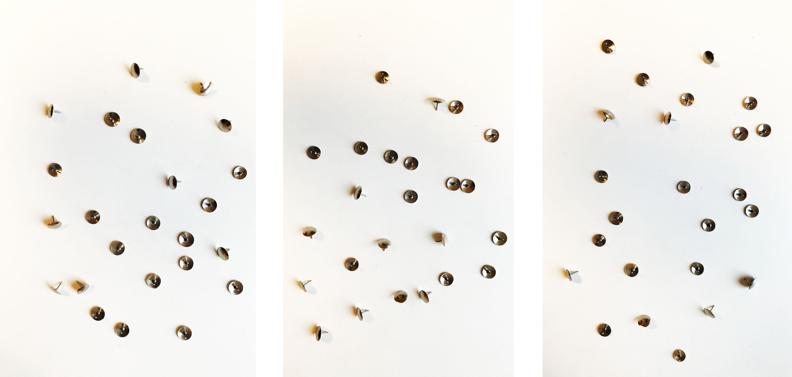{#fig-reisszwecken width=70%}

::: beispiel
**Beispiel Reißzwecken:** Wie kann man nun die Wahrscheinlichkeit dafür bestimmen, dass eine Reißzwecke mit der Spitze auf dem Boden landet (und somit keine Gefahr für die Füße darstellt)?

Zunächst werten wir das Experiment aus und erhalten die Sequenz

```{r}
#| results: asis
cat(gsub("(.{24})", "\\1 ", reisszwecken))
```

von insgesamt `r nrow(d_reisszwecken)` geworfenen Reißzwecken. Wir wollen dabei davon ausgehen, dass sich alle Reißzwecken gleich verhalten und wir von `r nrow(d_reisszwecken)` Experimenten ausgehen können.

Nun können wir die relative Häufigkeit des Ereignisses $\{U\}$ nach jedem Wurf einer Reißzwecke berechnen. Für die ersten sechs Würfe erhalten wir die Werte
$$
\begin{aligned}
f_1(\{U\}) & = \frac{1}{1} = 1,
&
f_2(\{U\}) & = \frac{2}{2} = 1,
&
f_3(\{U\}) & = \frac{3}{3} = 1,
\\[1em]
f_4(\{U\}) & = \frac{3}{4} = 0.75,
&
f_5(\{U\}) & = \frac{3}{5} = 0.6,
&
f_6(\{U\}) & = \frac{4}{6} = 0.667.
\end{aligned}
$$
Für alle `r nrow(d_reisszwecken)` Würfe sind das die relativen Häufigkeiten

```{r}
tab_reisszwecken()
```

die unten nochmal in einem Plot dargestellt sind.

```{r}
#| fig-asp: 0.5

ggplot(data = d_reisszwecken, mapping = aes(x = wurf, y = f)) +
  geom_line() +
  geom_point(shape = 21, fill = "orange") +
  labs(x = "Wurf", y = "Relative Häufigkeit")
```

Wir sehen den relativen Häufigkeiten an, dass sie sich bei einem Wert zwischen 0.3 und 0.4 einzupendeln scheinen. Wir können uns nun vorstellen, dass sich der Wert weiter stabilisiert, wenn wir die Versuchsreihe weiter fortsetzen. Genau dieser Gedanke liegt der frequentistischen Definition der Wahrscheinlichkeit zugrunde.
:::

In der frequentistischen Sicht auf Wahrscheinlichkeiten wird davon ausgegangen, dass sich die relativen Häufigkeiten bei der wiederholten Durchführung eines Zufallsexperiments bei einem festen Wert einpendeln und dieser Wert dann genau der Wahrscheinlichkeit für das untersuchte Ereignis entspricht. Formal schreibt sich das dann als
$$
P(A) = \lim_{n \to \infty} f_n(A),
$$
wobei $f_n(A)$ die relative Häufigkeit des Eintretens von $A$ nach der Durchführung von $n$ Versuchen bezeichnet.

Der frequentistische Wahrscheinlichkeitsbegriff wird vor allem mit dem Mathematiker Richard von Mises (1883–1953) in Verbindung gebracht. Hier wird die Wahrscheinlichkeit als quasi physikalische Größe angesehen, mit der eine Eigenschaft des betrachteten Vorgangs objektiv erfasst wird. Übrigens: Es ist derselbe von Mises, den Sie vielleicht aus dem Stahlbau kennen (von Mises Vergleichsspannung).

Problematisch dabei ist, dass Versuche in der Praxis natürlich nicht unendlich oft durchgeführt werden können. Allerdings gibt es Methoden, mit denen Wahrscheinlichkeiten auf der Grundlage von relativen Häufigkeiten geschätzt werden können.

## Subjektive Wahrscheinlichkeit

Von der Vorstellung, dass es sich bei der Wahrscheinlichkeit um eine quasi physikalische Größe handelt, hat man sich bei dem subjektiven Wahrscheinlichkeitsbegriff befreit. Die Wahrscheinlichkeit quantifiziert hier den Grad, in dem ein Betrachter an das Eintreten eines bestimmten Ereignisses glaubt. Die subjektivistische Schule geht vor allem zurück auf Bruno de Finetti (1906–1986) und Leonard J. Savage (1917–1971), wird aber auch mit Thomas Bayes (1701–1761, Mathematiker, Philosoph und Pfarrer) in Verbindung gebracht und wird daher auch bayesscher Wahrscheinlichkeitsbegriff genannt.

::: beispiel
**Beispiele für subjektive Wahrscheinlichkeiten:**

a. Die Aussage, dass sich jemand nach der Hinrunde zu 90 % sicher ist, dass ein bestimmter Club deutscher Meister wird, ist ein Beispiel für eine subjektive Wahrscheinlichkeit.

a. Man kann darüber diskutieren, ob die Wahrscheinlichkeit von 3.6 Millionstel für eine Kernschmelze in einem Betriebsjahr eine objektive Größe ist oder den Glauben der Verfasser zum Ausdruck bringt, dass das Kraftwerk sehr sicher ist. Obwohl das entsprechende Dokument [@deutsche_1990] 850 Seiten umfasst, ist es unmöglich, dass die Verfasser alle Eventualitäten voraussehen können; denken Sie zum Beispiel an den Unfall von Fukushima im März 2011 [@katastrophe_2012].
:::

## Axiomatische Definition {#sec-axiomatische-definition}

Von den drei beschriebenen Wahrscheinlichkeitsbegriffen (Laplace, frequentistisch, subjektiv) hat sich keiner als allgemein gültig erwiesen. Dies ist erst in den 1930er Jahren gelungen, als der sowjetische Mathematiker Andrej Kolmogoroff (1903–1987) das Rechnen mit Wahrscheinlichkeiten axiomatisch begründete. Der Clou bei seinem Ansatz besteht darin, dass er sich nicht mit möglichen Interpretationen, was eine Wahrscheinlichkeit denn nun sei, herumschlägt. Stattdessen legt er einfach die Spielregeln fest, an die man sich beim Rechnen mit Wahrscheinlichkeiten zu halten hat. Damit ist der Rahmen geschaffen, in dem die Laplace-Wahrscheinlichkeit, die frequentistische Sichtweise und der subjektive Ansatz friedlich nebeneinander existieren können.

Kolmogoroff benötigt drei Dinge, um die Spielregeln für die Mathematik des Zufalls festzulegen:

a. Eine beliebige Menge $\Omega$ (unsere Ergebnismenge), die natürlich nicht leer sein darf.

a. Ein Mengensystem $\mathcal{A} \subset \mathcal{P}(\Omega)$ von Teilmengen von $\Omega$. Dabei muss $\mathcal{A}$ eine $\sigma$-Algebra bilden (siehe @fig-sigma-algebra).

a. Eine Funktion $P : \mathcal{A} \to \mathbb{R}$, die jedem Element von $\mathcal{A}$ eine reelle Zahl zuordnet und damit die Wahrscheinlichkeit für das Eintreten von Ereignissen bewertet.

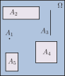{#fig-sigma-algebra width=40%}

Ein Mengensystem $\mathcal{A} \subset \mathcal{P}(\Omega)$ von Teilmengen von $\Omega$ heißt [$\sigma$-Algebra]{.neuerbegriff}, wenn gilt:

1. Für alle $A \in \mathcal{A}$ gilt auch $\overline{A} \in \mathcal{A}$.

1. Für eine abzählbare Anzahl von Mengen $A_1, A_2, \dots \in \mathcal{A}$ ist auch $A_1 \cup A_2 \cup \dots \in \mathcal{A}$.

Aus diesen Eigenschaften folgt, dass $\Omega \in \mathcal{A}$ und $\varnothing \in \mathcal{A}$.

Die Ergebnismenge $\Omega$ mit allen möglichen Ergebnissen unseres Zufallsvorgangs haben wir bereits kennengelernt.

Das Mengensystem $\mathcal{A}$ enthält die Ereignisse, für die wir uns interessieren, und heißt daher Ereignismenge oder Ereignisraum. Dass es sich bei $\mathcal{A}$ um eine $\sigma$-Algebra handelt, ist vor allem für Mathematiker interessant. Sie müssen die Sache wasserdicht machen und sicherstellen, dass es auch dann mit rechten Dingen zugeht, wenn man sehr kreativ darin ist, Mengen und Mengenoperationen zu erfinden. Zum Beispiel muss ausgeschlossen werden, dass man eine Kugel dadurch verdoppeln kann, dass man sie speziell aufteilt und die Teile dann neu zusammensetzt (Banach-Tarski-Paradoxon). Uns reicht die Vorstellung völlig aus, dass $\mathcal{A}$ eine geeignete Teilmenge der Potenzmenge von $\Omega$ ist. Für eine endliche Menge $\Omega$ verwenden wir sowieso einfach $\mathcal{A} = \mathcal{P}(\Omega)$.

Der zentrale Baustein ist für uns die Funktion $P$, die Wahrscheinlichkeitsfunktion genannt wird. Sie ordnet einem Ereignis $A \in \mathcal{A}$ eine Wahrscheinlichkeit $P(A)$ zu. Dabei soll gelten, dass $P(A) = 0$ ist, falls das Ereignis $A$ unmöglich ist, negative Wahrscheinlichkeiten werden ausgeschlossen. Für das sichere Ereignis $\Omega$ wird $P(\Omega) = 1$ gesetzt. Darüber hinaus soll die Wahrscheinlichkeit für das Eintreten von $A$ oder $B$ gleich der Summe der Wahrscheinlichkeiten der Einzelereignisse sein, wenn die Schnittmenge von $A$ und $B$ leer ist. Dies deckt sich mit unserer Vorstellung, dass es doppelt so wahrscheinlich ist, eine 1 oder eine 6 zu würfeln wie eine der beiden Augenzahlen allein.

Diese Anforderungen sind in dem Axiomensystem von Kolmogoroff zusammengefasst.

::: {#def-kolmogoroff}
## Axiomensystem von Kolmogoroff

Sei $\Omega$ eine nichtleere Menge (die Ergebnismenge), $\mathcal{A}$ ein geeignetes System von Teilmengen von $\Omega$ und $P$ eine Funktion, die jedem Element von $\mathcal{A}$ eine reelle Zahl zuordnet. Das Mengensystem $\mathcal{A}$ nennen wir [Ereignismenge]{.neuerbegriff} oder [Ereignisraum]{.neuerbegriff}. Die Funktion $P$ heißt [Wahrscheinlichkeit]{.neuerbegriff} oder [Wahrscheinlichkeitsfunktion]{.neuerbegriff}, wenn sie folgende Eigenschaften besitzt:

(K1)

: $P(A) \geq 0$

(K2)

: $P(\Omega) = 1$

(K3)

: $P(A_1 \cup A_2 \cup \dots ) = P(A_1) + P(A_2) + \dots = \sum_{i = 1}^{\infty}P(A_i)$, falls $A_1, A_2, \dots$ paarweise disjunkte Mengen aus $\mathcal{A}$ sind.

Anmerkungen:

- Ist die Ergebnismenge endlich, dann reduziert sich (K3) zu $P(A \cup B) = P(A) + P(B)$, falls $A$ und $B$ disjunkt sind.

- Falls die Ergebnismenge $\Omega$ endlich ist, verwenden wir für $\mathcal{A}$ die Potenzmenge von $\Omega$.

- Ein Tripel $(\Omega, \mathcal{A}, P)$ mit den beschriebenen Eigenschaften wird [Wahrscheinlichkeitsraum]{.neuerbegriff} genannt.
:::

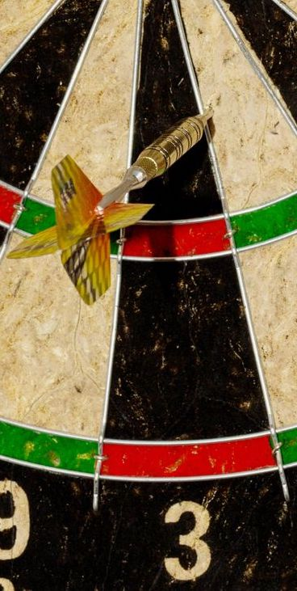{width=30%}

Warum definiert man die Funktion $P$ für Teilmengen von $\Omega$ (also Ereignisse) und nicht einfach für Elemente von $\Omega$, also Ergebnisse? Man müsste dann doch einfach von den Wahrscheinlichkeiten der einzelnen Ergebnisse auf die Wahrscheinlichkeit von Ereignissen schließen können. Für eine endliche oder eine abzählbar unendliche Ergebnismenge wäre das durchaus eine Möglichkeit, aber für überabzählbar unendliche Mengen funktioniert das nicht. Wir können uns das leicht am Beispiel der Dartscheibe klarmachen.

Auf der Dartscheibe gibt es unendlich viele Punkte. Die Wahrscheinlichkeit, dass einer dieser Punkte genau getroffen wird, ist verschwindend gering. Hier macht es nur Sinn, über die Wahrscheinlichkeit dafür zu sprechen, dass ein bestimmter Bereich der Scheibe getroffen wird, zum Beispiel das Triple-20-Feld.

Aus den Axiomen von Kolmogoroff lassen sich die folgenden Rechenregeln ableiten.

**Rechenregeln für Wahrscheinlichkeiten:** Sei $(\Omega, \mathcal{A}, P)$ ein Wahrscheinlichkeitsraum und $A, B \in \mathcal{A}$ Ereignisse, dann gilt

1. $0 \leq P(A) \leq 1$,

1. $P(\varnothing) = 0$,

1. $P(A) \leq P(B)$, falls $A \subset B$,

1. $P(\overline{A}) = 1 - P(A)$, wobei $\overline{A} = \Omega \setminus A$,

1. $P(A_1 \cup A_2 \cup \dots \cup A_n) = P(A_1) + P(A_2) + \dots + P(A_n)$, falls $A_i \in \mathcal{A}$ und $A_1, A_2, \dots, A_n$ paarweise disjunkt,

1. $P(A \cup B) = P(A) + P(B) - P(A \cap B)$.

::: beispiel
**Beispiel Glücksrad:** Ein faires Glücksrad ist in vier Felder unterteilt, die mit den Zahlen 1–4 bezeichnet sind. Damit ist $\Omega = \{1, 2, 3, 4\}$ die Ergebnismenge des Zufallsexperiments. Für die Ereignismenge setzen wir die Potenzmenge von $\Omega$ ein, so dass
$$
\mathcal{A} = \mathcal{P}(\Omega) = \{\varnothing, \{1\}, \{2\}, \{3\}, \{1, 2\}, \dots, \{1, 2, 3, 4\}\} \quad \text{mit} \quad |\mathcal{A}| = 2^4 = 16
$$
ist. Die ersten beiden Felder überspannen jeweils ein Achtel des Rades, das dritte Feld ein Viertel und das vierte Feld die Hälfte. Dementsprechend sind die Wahrscheinlichkeiten für die Elementarereignisse durch
$$
P(\{1\}) = P(\{2\}) = 1/8, \quad P(\{3\}) = 1/4 \quad \text{und} \quad P(\{4\}) = 1/2
$$
gegeben. Entsprechend der Rechenregel 5 ergeben sich dann die Wahrscheinlichkeiten für die zusammengesetzten Ereignisse aus den Summen der Wahrscheinlichkeiten der Elementarereignisse.

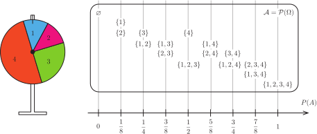
:::
