```{r}
#| include: false
source(rprojroot::is_quarto_project$find_file("_bcd-setup.R"))
source("01-daten/zufallsvariablen.R")
```

# Zufallsvariablen

In @sec-axiomatische-definition hatten wir festgehalten, dass wir Zufallsvorgänge mathematisch beschreiben können, wenn wir das Tripel $(\Omega, \mathcal{A}, P)$ angeben können. Bislang ist uns das aber nur für sehr einfach strukturierte Aufgaben gelungen, nämlich für die Beispiele aus der Kombinatorik.

Wie können wir aber mit Wahrscheinlichkeiten rechnen, wenn es sich um Vorgänge handelt, bei denen die interessierenden Größen Zahlen sind? Mögliche Fragen könnten hier zum Beispiel lauten:

- Wie groß ist die Wahrscheinlichkeit dafür, dass in Bochum im August weniger als 50 mm Niederschlag fallen?

- Mit welcher Wahrscheinlichkeit bin ich auf meiner Fahrt mit dem Zug von Bochum nach Berlin mehr als 30 Minuten verspätet?

- Wie groß ist die Wahrscheinlichkeit für einen Wurf mit 10 oder mehr Punkten beim Darts?

Die Verbindung zwischen den abstrakten Gesetzen der Wahrscheinlichkeitstheorie (so wie wir sie seit Kolmogoroff verwenden) und der uns vertrauten Welt der (reellen) Zahlen wird durch die Idee der Zufallsvariablen hergestellt. In dem wahrscheinlichkeitstheoretischen Modell eines stochastischen Vorgangs wird das in der Realität beobachtete Merkmal nun Zufallsvariable genannt. Diesen Zusammenhang können wir uns am Beispiel des Dartspiels klarmachen.

## Zufallsvariablen beim Darts spielen

Es wird ein Pfeil auf eine Dartscheibe geworfen. Die Position der Pfeilspitze können wir in kartesischen Koordinaten mit $\omega = (x, y) \in \Omega \subset \mathbb{R}^2$ beschreiben. Wir interessieren uns nun für die mit einem Wurf $\omega$ erreichte Punktzahl und den Abstand des Pfeils vom Mittelpunkt.

### Experiment

Bevor wir uns theoretisch überlegen, wie die Wahrscheinlichkeiten verteilt sind, betrachten wir die Auswertung von 2500 Würfen auf eine Dartscheibe (Bild unten). In Ermangelung einer Dartscheibe wurde das Experiment durch ein R-Programm realisiert und auf dem Computer durchgeführt.

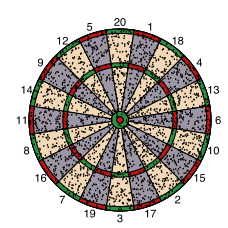{width=40%}

Für die erreichte Punktzahl sind die relativen Häufigkeiten links in einem Balkendiagramm dargestellt, für den Radius eignet sich eine Darstellung als Histogramm (rechts).

```{r}
#| fig-asp: 0.35

p1 <- ggplot(data = d_darts) +
  geom_bar(mapping = aes(x = z, y = after_stat(prop)), fill = "light blue", color = "black") +
  labs(x = "Punktzahl x", y = "Relative Häufigkeit") +
  coord_cartesian(ylim = c(0, 0.06))

p2 <- ggplot(data = d_darts) +
  geom_histogram(
    mapping = aes(x = r, y = after_stat(density)),
    binwidth = 5, boundary = 0, fill = "light blue", color = "black"
  ) +
  scale_x_continuous(breaks = c(0, 85, 160 + 10)) +
  labs(x = "Radius r", y = "Relative Häufigkeit")

p1 + p2
```

Ebenfalls dargestellt sind die empirischen Verteilungsfunktionen für die beiden Merkmale. Die Punktzahl ist ein diskretes Merkmal, entsprechend hat die Verteilungsfunktion Sprünge. Für den Radius sind die Sprünge mit dem bloßen Auge fast nicht zu erkennen, da es sich um ein stetiges Merkmal handelt.

```{r}
#| fig-asp: 0.35

p1 <- ggplot(data = d_darts) +
  stat_ecdf(mapping = aes(x = z)) +
  labs(x = "Punktzahl x", y = "F(x)")

p2 <- ggplot(data = d_darts) +
  stat_ecdf(mapping = aes(x = r)) +
  labs(x = "Radius r", y = "F(r)") +
  scale_x_continuous(breaks = c(0, 85, 160 + 10))

p1 + p2
```

Für Mittelwert und Standardabweichung erhalten wir die folgenden Werte:

```{r}
tibble(
  name = c("Punktzahl", "Radius"),
  Mittelwert = c(mean(d_darts$z), mean(d_darts$r)),
  Standardabweichung = c(sd(d_darts$z), sd(d_darts$r))
) |>
  gt(rowname_col = "name") |>
  fmt_number(decimals = 4, n_sigfig = 4) |>
  tab_options(table.width = pct(50))
```

Wir werden uns nun überlegen, wie wir diese Ergebnisse auf der Basis von theoretischen Überlegungen voraussagen können.

### Punktzahl (diskrete Zufallsvariable)

Wenn wir wieder davon ausgehen, dass die Pfeile zufällig verteilt auf der Dartscheibe landen, dann entsprechen die Wahrscheinlichkeiten für die einzelnen Felder den jeweiligen Flächenanteilen. Mit den Radien $r_1 = 6.35\,\mathrm{mm}$, $r_2 = 15.9\,\mathrm{mm}$, $r_3 = 99\,\mathrm{mm}$, $r_4 = 107\,\mathrm{mm}$, $r_5 = 162\,\mathrm{mm}$ und $r_6 = 170\,\mathrm{mm}$ erhalten wir die Wahrscheinlichkeiten
$$
P(\text{„Bull's Eye"}) \approx 0.0014
\quad
P(\text{„Bull"}) \approx 0.0074
$$
für das Bull's Eye sowie
$$
P(\text{„Single"}) \approx 0.0420
\quad
P(\text{„Double Ring"}) \approx 0.0046
\quad
P(\text{„Triple Ring"}) \approx 0.0029
$$
für die drei unterschiedlich zählenden Zahlenfelder. Dabei gilt natürlich
$$
0.0014 + 0.0074 + 20 \cdot (0.042 + 0.0046 + 0.0029) \approx 1,
$$
die Wahrscheinlichkeiten summieren sich zum sicheren Ereignis auf.

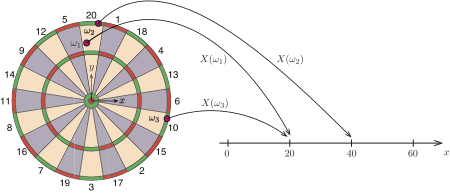

Entsprechend den Regeln des Dartspiels wird nun einer Position des Pfeils $\omega = (x, y) \in \Omega$ ein Zahlenwert $X(\omega) \in \mathbb{R}$ zugeordnet. Wir können $X$ daher als eine Funktion auffassen, die einem Element der Ergebnismenge $\Omega$ eine Zahl zuordnet. Die Zuordnungsvorschrift dieser Funktion lautet dabei
$$
X(\omega) =
\begin{cases}
50 & \text{falls} \; r \leq 6.35 \\
25 & \text{falls} \; r \leq 15.9 \\
m(r) \cdot v(\varphi) & \text{sonst}
\end{cases}
\qquad \text{mit} \qquad
\begin{array}{l}
\displaystyle r = \sqrt{x^2 + y^2} \\[1em]
\displaystyle \varphi = \arctan \frac{y}{x}
\end{array}
$$
sowie
$$
m(r) =
\begin{cases}
3 & \text{falls} \quad r_3 \leq r \leq r_4 \\
2 & \text{falls} \quad r \geq r_5 \\
1 & \text{sonst}
\end{cases}
\quad \text{und} \quad
v(\varphi) = \text{Wert des Feldes zum Winkel } \varphi.
$$
Anmerkung: Die Zuordnungsvorschrift von $X$ ist hier nur der Vollständigkeit halber angegeben, wir werden sie nicht weiter benötigen.

::: {#def-zufallsvariable}
## Zufallsvariable

Eine Variable oder ein Merkmal $X$, dessen Werte oder Ausprägungen die Ergebnisse eines Zufallsvorgangs sind, heißt [Zufallsvariable]{.neuerbegriff} $X$. Die Zahl $x \in \mathbb{R}$, die $X$ bei einer Durchführung des Zufallsvorgangs annimmt, heißt [Realisierung]{.neuerbegriff} oder Wert von $X$.

In der Mathematik wird eine Zufallsvariable formal als Abbildung
$$
X : \Omega \to \mathbb{R}
$$
aufgefasst, die jedem Ergebnis $\omega \in \Omega$ eines Zufallsvorgangs eine reelle Zahl $x = X(\omega)$ zuordnet.

Zufallsvariablen werden in der Regel mit Großbuchstaben vom Ende des Alphabets bezeichnet.
:::

Wie wir uns in @sec-zufallsvorgang bereits überlegt haben, können beim Dart nur bestimmte Punktzahlen auftreten. Es gilt für alle $\omega \in \Omega$, dass
$$
\begin{aligned}
X(\omega) \in \{
& 1, \dots, 20, 21, 22, 24, 25, 26, 27, 28, 30, 32, 33, 34, 36, \\
& 38, 39, 40, 42, 45, 48, 50, 51, 54, 57, 60\}.
\end{aligned}
$$
Es können von $X$ also nur endlich viele verschiedene Werte angenommen werden.

Wir können uns nun fragen, mit welcher Wahrscheinlichkeit die verschiedenen Punktzahlen auftreten. Der Wert $50$ kann zum Beispiel nur durch einen Treffer im Bull's Eye erzielt werden. Die zugehörige Wahrscheinlichkeit bezeichnen wir mit $P(X = 50)$ und erhalten
$$
P(X = 50) = P(\text{„Bull's Eye"}) \approx 0.0014.
$$
Demgegenüber kann der Wert $20$ durch einen Treffer in „einfach 20" oder „doppelt 10" erreicht werden. Die beiden Ereignisse sind disjunkt und wir können die Wahrscheinlichkeiten addieren. Damit ist
$$
P(X = 20) = P(\text{„Single"}) + P(\text{„Double Ring"}) \approx 0.0420 + 0.0046 = 0.0466.
$$
Wir können nun auf diese Art für alle zu erzielenden Punktzahlen $x_i$ die zugehörige Wahrscheinlichkeit $p_i = P(X = x_i)$ bestimmen. Wir erhalten die nachfolgend dargestellte Tabelle und das zugehörige Stabdiagramm.

```{r}
d_darts_theorie |>
  mutate(i = row_number()) |>
  filter(i %in% c(1:10, 21:25, 39:43)) |>
  transmute(i = as.character(i), z = as.character(z), p = sprintf("%.4f", p)) |>
  add_row(i = "...", z = "...", p = "...", .after = 10) |>
  add_row(i = "...", z = "...", p = "...", .after = 16) |>
  select(i, z, p) |>
  gt() |>
  cols_label(i = "i", z = "x_i", p = "p_i") |>
  cols_align(align = "center") |>
  tab_options(table.width = pct(40))
```

```{r}
#| fig-asp: 1

by <- c(0, sort(unique(f_darts(w)))[-4])

ggplot(data = d_darts_theorie) +
  geom_col(
    mapping = aes(x = z, y = p, fill = factor(p)),
    color = "black", show.legend = FALSE
  ) +
  labs(x = "x", y = "P(X = x)") +
  scale_x_continuous(breaks = c(1, 8, 3, 6, 12, 18, 21, 25, 34, 30, 50, 60)) +
  scale_y_continuous(breaks = by, labels = function(x) sprintf("%4.4f", x)) +
  scale_fill_brewer(palette = "Set3") +
  theme(panel.grid.minor = element_blank())
```

::: {#def-diskrete-zufallsvariable}
## Diskrete Zufallsvariable

Eine Zufallsvariable $X$, die nur endlich oder abzählbar unendlich viele verschiedene Werte $x_1, x_2, \dots$ annehmen kann, heißt [diskrete Zufallsvariable]{.neuerbegriff}. Wir gehen immer davon aus, dass die Werte $x_i$ aufsteigend sortiert sind. Die Wahrscheinlichkeiten
$$
p_i = P(X = x_i), \quad i = 1, 2, \dots,
$$
mit denen diese Werte auftreten können, werden [Wahrscheinlichkeitsverteilung]{.neuerbegriff} der Zufallsvariablen genannt. Die Menge der Werte, die von $X$ angenommen werden können, bezeichnen wir mit $X(\Omega)$.
:::

Wir sehen, dass sich die Wahrscheinlichkeiten für die einzelnen Punktzahlen aus den Einfach-, Zweifach- und Dreifachfeldern zusammensetzen, Bull und Bull's Eye zählen getrennt. Mit den Hilfsfunktionen
$$
\begin{aligned}
h_{\mathrm{s}}(x)
& =
\begin{cases}
1 & \text{falls } 1 \leq x \leq 20 \\[1ex]
0 & \text{sonst}
\end{cases}
&& \text{(Einfachfeld)}
\\[1em]
h_{\mathrm{d}}(x)
& =
\begin{cases}
1 & \text{falls } 1 \leq x \leq 40 \text{ und } x \text{ ist Vielfaches von } 2 \\[1ex]
0 & \text{sonst}
\end{cases}
&& \text{(Zweifachfeld)}
\\[1em]
h_{\mathrm{t}}(x)
& =
\begin{cases}
1 & \text{falls } 1 \leq x \leq 60 \text{ und } x \text{ ist Vielfaches von } 3 \\[1ex]
0 & \text{sonst}
\end{cases}
&& \text{(Dreifachfeld)}
\end{aligned}
$$
können wir die Wahrscheinlichkeit für den Wert $x$ nun mithilfe der Funktion $f : \mathbb{R} \to \mathbb{R}$,
$$
f(x) =
\begin{cases}
0.0014 & \text{falls } x = 50 \\
0.0074 & \text{falls } x = 25 \\
0.0420 \cdot h_{\mathrm{s}}(x) + 0.0046 \cdot h_{\mathrm{d}}(x) + 0.0029 \cdot h_{\mathrm{t}}(x) & \text{sonst}
\end{cases}
$$
angeben. Beachten Sie, dass $f(x) = 0$ gilt, falls $x$ keine gültige Punktzahl im Dart ist und somit $x \notin X(\Omega)$ gilt. Die Funktion $f$ heißt Wahrscheinlichkeitsfunktion.

::: {#def-wahrscheinlichkeitsfunktion}
## Wahrscheinlichkeitsfunktion

Für eine diskrete Zufallsvariable $X$ heißt die Funktion $f : \mathbb{R} \to \mathbb{R}$ mit
$$
f(x) =
\begin{cases}
P(X = x) & \text{falls } x \in X(\Omega) = \{x_1, x_2, \dots \} \\[1ex]
0 & \text{sonst}
\end{cases}
$$
[Wahrscheinlichkeitsfunktion]{.neuerbegriff} von $X$.
:::

Die Wahrscheinlichkeitsfunktion einer diskreten Zufallsvariablen ist nur für einzelne Werte von $x$ ungleich 0. Die übliche Darstellung für den Graphen einer nicht-stetigen Funktion ist unten links zu sehen. Andere gebräuchliche Darstellungsformen sind das Stabdiagramm (Mitte) und das Wahrscheinlichkeitshistogramm rechts.

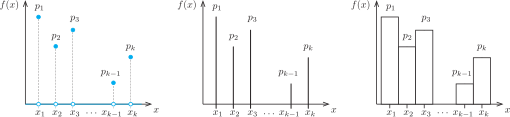

Für das Dartspiel können wir uns nun noch fragen, mit welcher Wahrscheinlichkeit die Punktzahl höchstens gleich einem vorgegebenen Wert ist. Dabei gilt beim Darts auf jeden Fall
$$
P(X \leq 0) = 0
\quad \text{und} \quad
P(X \leq 60) = 1,
$$
da nicht weniger als ein Punkt und nicht mehr als 60 Punkte erreicht werden können. Für die Werte dazwischen müssen die Wahrscheinlichkeiten aufaddiert werden. Zum Beispiel ist
$$
\begin{aligned}
P(X \leq 5)
& = p_1 + p_2 + p_3 + p_4 + p_5 \\
& = 0.0421 + 0.0467 + 0.0450 + 0.0467 + 0.0421 = 0.2226.
\end{aligned}
$$
Die Wahrscheinlichkeiten dürfen addiert werden, da es sich bei den Werten $p_i$ um die Wahrscheinlichkeiten disjunkter Ereignisse handelt. Auf dieser Grundlage definieren wir die Funktion $F : \mathbb{R} \to [0, 1]$ mit
$$
F(x) = P(X \leq x) =
\begin{cases}
0 & \text{für } x \leq 0 \\
0.0421 & \text{für } 0 < x \leq 1 \\
0.0421 + 0.0467 = 0.0888 & \text{für } 1 < x \leq 2 \\
\qquad \vdots \\
1 & \text{für } x \geq 60
\end{cases}
$$
und sagen dazu Verteilungsfunktion.

```{r}
#| fig-asp: 0.6

d <- tibble(x = w, y = cumsum(f_darts(w))) |>
  mutate(xe = lead(w)) |>
  select(x, xe, y) |>
  add_row(x = -10, xe = 1, y = 0, .before = 1) |>
  add_row(x = 60, xe = 69, y = 1, .after = 43) |>
  drop_na()

ggplot() +
  geom_segment(data = d, mapping = aes(x = x, y = y, xend = xe, yend = y)) +
  geom_point(data = subset(d, x >= 1), mapping = aes(x = x, y = y), size = 0.6) +
  geom_point(data = subset(d, xe < 60), mapping = aes(x = xe, y = y), size = 0.6, shape = 21) +
  scale_x_continuous(breaks = c(1, 20, 50, 60)) +
  scale_y_continuous(breaks = c(0, 1)) +
  labs(x = "x", y = "F(x)") +
  theme(panel.grid.minor = element_blank())
```

::: {#def-verteilungsfunktion}
## Verteilungsfunktion

Zu einer Zufallsvariablen $X$ heißt die Funktion $F : \mathbb{R} \to [0, 1]$ mit
$$
F(x) = P(X \leq x)
$$
[Verteilungsfunktion]{.neuerbegriff} der Zufallsvariablen.

Für eine diskrete Zufallsvariable hat die Funktion die Form
$$
F(x) = \sum_{i : x_i \leq x} f(x_i),
$$
es werden also die Einzelwahrscheinlichkeiten der Werte $x_i$ mit $x_i \leq x$ summiert.
:::

**Eigenschaften der Verteilungsfunktion einer diskreten Zufallsvariablen:** Für die Verteilungsfunktion $F : \mathbb{R} \to [0, 1]$ einer diskreten Zufallsvariablen $X$ gilt:

1. Die Funktion ist monoton wachsend mit
    $$
    \lim_{x \to -\infty} F(x) = 0
    \quad \text{und} \quad
    \lim_{x \to \infty} F(x) = 1.
    $$

1. Die Wahrscheinlichkeit, dass $X$ den Wert $x$ überschreitet, ist
    $$
    P(X > x) = 1 - F(x).
    $$

1. Die Wahrscheinlichkeit, dass $X$ im Intervall $(a, b]$ liegt, ist
    $$
    P(a < X \leq b) = F(b) - F(a).
    $$

1. Sprunghöhen der Funktion $F$ an den Stellen $x_i$ entsprechen den Einzelwahrscheinlichkeiten $p_i$.

#### Erwartungswert, Varianz und Standardabweichung

Was passiert, wenn wir die Punktwerte beim Dart mit ihren jeweiligen Wahrscheinlichkeiten multiplizieren und aufsummieren? Wir berechnen hierzu
$$
\operatorname{E}(X)
= 1 \cdot 0.0421 + 2 \cdot 0.0467 + 3 \cdot 0.0450 + \dots + 57 \cdot 0.0029 + 60 \cdot 0.0029
= 12.82
$$
und sehen, dass dieser Wert sehr nahe an dem im Versuch empirisch ermittelten Mittelwert liegt. Die Zahl heißt der Erwartungswert der Zufallsvariablen.

::: {#def-erwartungswert-diskret}
## Erwartungswert einer diskreten Zufallsvariablen

Der [Erwartungswert]{.neuerbegriff} $\operatorname{E}(X)$ einer diskreten Zufallsvariablen ist definiert als die Summe der möglichen Werte der Zufallsvariablen multipliziert mit den zugehörigen Wahrscheinlichkeiten:
$$
\operatorname{E}(X) = x_1 f(x_1) + x_2 f(x_2) + \dots = \sum_{i \geq 1} x_i f(x_i).
$$
Für den Erwartungswert schreibt man häufig auch kurz $\mu_X$ oder $\mu$.
:::

Um die empirische Varianz zu berechnen, haben wir die Abweichungen vom Mittelwert quadriert und aufsummiert. Entsprechend berechnen wir nun die Summe
$$
\begin{aligned}
\operatorname{Var}(X)
= {} & (1 - 12.82)^2 \cdot 0.0421 + (2 - 12.82)^2 \cdot 0.0467 + (3 - 12.82)^2 \cdot 0.0450 + \dots \\
& + (57 - 12.82)^2 \cdot 0.0029 + (60 - 12.82)^2 \cdot 0.0029 = 90.9.
\end{aligned}
$$
Die Wurzel daraus, nämlich
$$
\sigma = \sqrt{90.9} = 9.534,
$$
liegt wieder recht nah bei dem empirisch bestimmten Wert aus dem Experiment.

::: {#def-varianz-diskret}
## Varianz und Standardabweichung einer diskreten Zufallsvariablen

Die [Varianz]{.neuerbegriff} einer diskreten Zufallsvariablen ist die Summe der Abstandsquadrate der Werte vom Mittelwert multipliziert mit den Wahrscheinlichkeiten, also
$$
\operatorname{Var}(X) = (x_1 - \mu)^2 f(x_1) + (x_2 - \mu)^2 f(x_2) + \dots = \sum_{i \geq 1} (x_i - \mu)^2 f(x_i).
$$
Die [Standardabweichung]{.neuerbegriff} beträgt
$$
\sigma = \sqrt{\operatorname{Var}(X)}.
$$
:::

### Abstand vom Mittelpunkt (stetige Zufallsvariable)

Wir betrachten nun die Frage, wie weit der Pfeil vom Mittelpunkt der Scheibe entfernt ist. Entsprechend definieren wir für das Ergebnis $\omega = (x, y) \in \Omega$ eine neue Zufallsvariable $X : \Omega \to \mathbb{R}$ mit der Zuordnungsvorschrift
$$
X(\omega) = \sqrt{x^2 + y^2}.
$$
Die Variable heißt wieder $X$, damit die Bezeichnung nicht von den Definitionen abweicht (die üblicherweise mit $X$ aufgeschrieben werden).

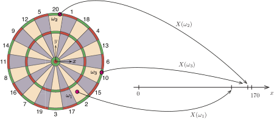

Wie können wir nun die Wahrscheinlichkeit für das Eintreten bestimmter Werte für den Radius charakterisieren? Würde es Sinn machen, wie bei der Punktzahl über das Eintreten einzelner Zahlenwerte für den Radius, zum Beispiel $P(X = 123.3864912)$, nachzudenken? Nach kurzem Überlegen lautet die Antwort natürlich „Nein", denn es gibt ja überabzählbar unendlich viele Werte zwischen 0 mm und 170 mm.

Was wir uns jedoch fragen können, ist, wie groß die Wahrscheinlichkeit ist, dass der Pfeil innerhalb eines Kreises mit einem bestimmten Radius auftrifft. Dabei sehen wir sofort, dass
$$
P(X \leq 170) = 1 \quad \text{und} \quad P(X \leq 0) = 0
$$
gelten muss. Für Werte dazwischen gilt, dass die Wahrscheinlichkeit dem Verhältnis der betrachteten Fläche zur Gesamtfläche entspricht. Wir erhalten also mit
$$
\frac{A_x}{A_\Omega} = \frac{\pi x^2}{\pi 170^2} = \frac{x^2}{28900}
$$
die Funktion $F: \mathbb{R} \to [0, 1]$ mit
$$
F(x) = P(X \leq x) =
\begin{cases}
0 & \text{falls } x \leq 0 \\
\displaystyle \frac{x^2}{28900} & \text{falls } 0 < x \leq 170 \\
1 & \text{sonst}
\end{cases}.
$$
Wir erinnern uns daran, dass diese Funktion auf genau dieselbe Art definiert ist wie die Verteilungsfunktion für die Punktzahl. Sie heißt folgerichtig ebenfalls Verteilungsfunktion, diesmal eben zu einer stetigen Zufallsvariablen.

Die Funktion $F$ ist für alle $x \in \mathbb{R} \setminus \{0, 170\}$ differenzierbar. Wir erhalten die Ableitungsfunktion $f : \mathbb{R} \setminus \{0, 170\} \to \mathbb{R}$ mit
$$
f(x) =
\begin{cases}
\displaystyle \frac{x}{14450} & \text{für } 0 < x < 170 \\
0 & \text{für } x < 0 \text{ und } x > 170.
\end{cases}
$$
Die Funktion $f$ heißt Wahrscheinlichkeitsdichte oder kurz Dichte der Zufallsvariablen $X$. Da $F$ monoton steigend ist, nimmt $f(x)$ nur Werte größer gleich null an.

Für den linksseitigen Grenzwert von $f$ für $x \to 170$ ergibt sich
$$
\lim_{x \nearrow 170} f(x) = \lim_{x \nearrow 170} \frac{x}{14450} = \frac{170}{14450} = \frac{1}{85} \approx 0.012
$$
und damit eine Zahl, die nah an dem empirischen Wert aus dem Histogramm der relativen Häufigkeiten liegt.

Die Graphen beider Funktionen sind nachfolgend dargestellt. Dabei entspricht die theoretische Verteilungsfunktion der empirischen Verteilungsfunktion und die Wahrscheinlichkeitsdichte dem Histogramm der relativen Häufigkeiten.

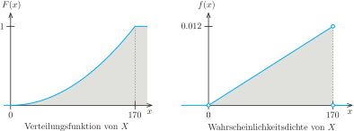{width=80%}

Wir haben nun am Beispiel des Dartspiels die Verteilungsfunktion und die Wahrscheinlichkeitsdichte einer stetigen Zufallsvariablen kennengelernt. Dabei hatten wir die Wahrscheinlichkeitsdichte aus der Verteilungsfunktion abgeleitet. In der Wahrscheinlichkeitsrechnung beginnt man üblicherweise mit der Wahrscheinlichkeitsdichte.

::: {#def-stetige-zufallsvariable}
## Stetige Zufallsvariablen und Dichten

Eine Zufallsvariable $X$ heißt [stetig]{.neuerbegriff}, wenn es eine Funktion $f : \mathbb{R} \to \mathbb{R}$ mit $f(x) \geq 0$ gibt, so dass für jedes Intervall $[a, b]$
$$
P(a \leq X \leq b) = \int_a^b f(x) \; dx = F(b) - F(a)
$$
gilt. Die Funktion $f$ heißt [Wahrscheinlichkeitsdichte]{.neuerbegriff} oder kurz [Dichte]{.neuerbegriff} von $X$.
:::

Die Wahrscheinlichkeit dafür, dass $X$ einen Wert zwischen $a$ und $b$ annimmt, entspricht damit genau dem Flächeninhalt unter dem Graphen der Wahrscheinlichkeitsdichte $f$ zwischen $a$ und $b$. Da $F$ eine Stammfunktion von $f$ ist, kann der Wert auch als Differenz $F(b) - F(a)$ berechnet werden (Hauptsatz der Differential- und Integralrechnung). Daher spielt es auch keine Rolle, ob die Grenzen des Intervalls mitgerechnet werden oder nicht. Gleichzeitig geht die Wahrscheinlichkeit gegen 0, wenn die Länge des Intervalls gegen 0 geht.

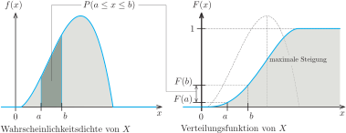{width=70%}

::: {#def-wahrscheinlichkeiten-stetig}
## Wahrscheinlichkeiten stetiger Zufallsvariablen

Für eine stetige Zufallsvariable $X$ gilt
$$
P(a \leq X \leq b) = P(a < X \leq b) = P(a \leq X < b) = P(a < X < b).
$$
Weiterhin ist für jedes $x \in \mathbb{R}$
$$
P(X = x) = 0
$$
($X = x$ heißt auch das quasi-unmögliche Ereignis).
:::

Das Ereignis $-\infty < X < \infty$ tritt sicher ein, so dass $P(-\infty < X < \infty) = 1$ gelten muss. Die Dichte besitzt also die

**Normierungseigenschaft:** Für die Dichte $f : \mathbb{R} \to \mathbb{R}$ einer Zufallsvariablen gilt
$$
\int_{-\infty}^\infty f(x) \; dx = 1,
$$
das heißt, die Gesamtfläche zwischen der $x$-Achse und dem Graphen von $f$ ist gleich 1.

Mit der bereits eingeführten Definition der Verteilungsfunktion $F : \mathbb{R} \to [0, 1]$ erhalten wir

::: {#def-verteilungsfunktion-stetig}
## Verteilungsfunktion einer stetigen Zufallsvariablen

Die Funktion $F : \mathbb{R} \to [0, 1]$ mit
$$
F(x) = P(X \leq x) = \int_{-\infty}^x f(t) \; dt
$$
heißt Verteilungsfunktion der Zufallsvariablen $X$.
:::

Die Eigenschaften der Verteilungsfunktion einer stetigen Zufallsvariablen entsprechen weitestgehend denen einer diskreten Variablen. Das ist auch klar, die zugrunde liegende Definition ist exakt dieselbe. Der Unterschied besteht darin, dass die Funktion jetzt stetig ist und Funktionswerte als Integral der Dichtefunktion berechnet werden und nicht mehr als Summe von Einzelwahrscheinlichkeiten.

**Eigenschaften der Verteilungsfunktion einer stetigen Zufallsvariablen:**

1. Die Funktion ist monoton wachsend mit Werten im Intervall $[0, 1]$.

1. Für die Grenzwerte gilt
    $$
    \lim_{x \to -\infty} F(x) = 0
    \quad \text{und} \quad
    \lim_{x \to \infty} F(x) = 1.
    $$

1. Für Werte, an denen $f$ stetig ist, gilt
    $$
    F'(x) = \frac{dF(x)}{dx} = f(x),
    $$
    die Dichte ist also die Ableitung der Verteilungsfunktion.

1. Für Intervalle erhält man
    $$
    P(a \leq X \leq b) = F(b) - F(a)
    \quad \text{und} \quad
    P(X > x) = 1 - F(x).
    $$

Beachten Sie, dass die Eigenschaften weitgehend mit denen diskreter Zufallsvariablen übereinstimmen.

#### Erwartungswert, Varianz und Standardabweichung

In der empirischen Untersuchung des Experiments haben wir auch für das stetige Merkmal „Abstand vom Ursprung" mit den uns bekannten Methoden einen Mittelwert und eine Standardabweichung berechnet. Wie können wir diese Werte nun auf der Basis theoretischer Überlegungen vorhersagen? Genau diese Information liefert uns der Erwartungswert einer Zufallsvariablen.

::: {#def-erwartungswert-stetig}
## Erwartungswert einer stetigen Zufallsvariablen

Der Erwartungswert $\operatorname{E}(X)$ einer stetigen Zufallsvariablen $X$ mit der Dichte $f$ ist
$$
\mu = \operatorname{E}(X) = \int_{-\infty}^\infty x \cdot f(x) \; dx.
$$
Falls die Dichte nur auf einem endlichen Intervall ungleich null ist, dann muss auch nur über diesen Bereich integriert werden.
:::

Wir erinnern uns (zum Beispiel aus Mathematik 2 im Bachelor) an die Methode zur Berechnung der $x$-Koordinate eines Flächenschwerpunkts. Zusammen mit der Normierungseigenschaft von Dichtefunktionen und der Definition des Erwartungswerts erhalten wir
$$
x_s
\overset{\text{Flächenschwerpunkt}}{=}
\frac{\int_a^b x \cdot f(x) \; dx}{\int_a^b f(x) \; dx}
\overset{\text{Normierungseigenschaft}}{=}
\int_a^b x \cdot f(x) \; dx
\overset{\text{Erwartungswert}}{=}
\operatorname{E}(X).
$$
Der Erwartungswert entspricht also gerade dem Schwerpunkt der Fläche unter der Dichtefunktion. Besitzt die Fläche darüber hinaus eine Symmetrieachse, die parallel zur $y$-Achse ist, dann liegt der Schwerpunkt auf dieser Symmetrieachse. Mathematisch ausgedrückt: Gibt es eine Zahl $c$ mit $f(c - x) = f(c + x)$ für alle $x \in \mathbb{R}$, dann ist $c$ der Erwartungswert.

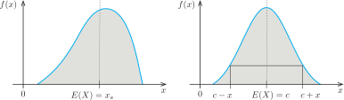{width=80%}

Für das Beispiel des Dartspiels ist die Wahrscheinlichkeitsdichte eine Dreiecksfunktion, den Schwerpunkt können wir daher einfach berechnen. Wir erhalten den Erwartungswert
$$
\operatorname{E}(X) = \frac{2}{3} \cdot 170 = 113.\overline{3} \, \mathrm{mm},
$$
der durch das Ergebnis des Experiments bestätigt wird.

Für die Varianz integrieren wir über den quadrierten Abstand von $x$ und Erwartungswert multipliziert mit der Dichte
$$
\operatorname{Var}(X) = \int_0^{170} \left(x - \frac{340}{3}\right)^2 \frac{x}{14450} \; dx = \dots = \frac{14450}{9} = 1605.\overline{5}
$$
und entsprechend die Standardabweichung
$$
\sigma = \sqrt{\frac{14450}{9}} = \frac{85 \sqrt{2}}{3} \approx 40.07
$$
und damit wieder einen Wert nahe dem Experiment.

::: {#def-varianz-stetig}
## Varianz und Standardabweichung einer stetigen Zufallsvariablen

Die Varianz einer stetigen Zufallsvariablen $X$ mit der Dichte $f$ ist
$$
\operatorname{Var}(X) = \int_{-\infty}^\infty (x - \mu)^2 \cdot f(x) \; dx,
$$
wobei $\mu$ der Erwartungswert von $X$ ist. Die Standardabweichung ist wieder
$$
\sigma = \sqrt{\operatorname{Var}(X)}.
$$
:::

### Zusammenfassung

Die wichtigsten Punkte hier nochmals zusammengefasst:

- Eine Zufallsvariable $X$ ordnet dem Ergebnis $\omega \in \Omega$ eines Zufallsvorgangs eine reelle Zahl $x = X(\omega)$ zu.

- Der Wert $x$ heißt Realisierung der Zufallsvariablen $X$.

- Die Wahrscheinlichkeiten dafür, dass $X$ bestimmte Werte annimmt, ergeben sich aus den Gegebenheiten des Zufallsvorgangs und werden durch die Verteilungsfunktion $F$ der Zufallsvariablen beschrieben.

- Die Verteilungsfunktion lässt sich aus der Wahrscheinlichkeitsfunktion (diskrete Variable) oder der Dichtefunktion (stetige Variable) herleiten.

- In der Praxis wird man Zufallsvariablen häufig einfach durch diese Funktionen charakterisieren und dabei nicht explizit auf den Zusammenhang mit einem Zufallsprozess eingehen.

- In der englischen Sprache wird *Probability density function* (PDF) für die Dichtefunktion und *Cumulative distribution function* (CDF) für die Verteilungsfunktion verwendet.

Den Zusammenhang zwischen empirischen Diagrammen und den auf der Grundlage theoretischer Überlegungen hergeleiteten Funktionen zeigen @fig-darts-punktzahl und @fig-darts-radius. In @tbl-zufallsvariablen sind die mathematischen Beziehungen für diskrete und stetige Zufallsvariablen zusammengestellt.

```{r}
#| label: fig-darts-punktzahl
#| fig-cap: "Punktzahl beim Dartspiel: empirisch (links) und theoretisch (rechts)"
#| fig-asp: 0.6

p1 <- ggplot(data = d_darts) +
  geom_bar(mapping = aes(x = z, y = after_stat(prop)), fill = "light blue", color = "black") +
  labs(x = "Punktzahl x", y = "Relative Häufigkeit") +
  coord_cartesian(ylim = c(0, 0.06))

p2 <- ggplot(data = d_darts_theorie) +
  geom_col(mapping = aes(x = z, y = p), fill = "light blue", color = "black") +
  coord_cartesian(ylim = c(0, 0.06)) +
  labs(x = "Punktzahl x", y = "f(x) = P(X = x)")

p3 <- ggplot(data = d_darts) +
  stat_ecdf(mapping = aes(x = z)) +
  labs(x = "Punktzahl x", y = "F(x)")

p4 <- ggplot(data = d_darts_theorie) +
  geom_step(mapping = aes(x = z, y = cumsum(p))) +
  labs(x = "Punktzahl x", y = "F(x)")

p1 + p2 + p3 + p4
```

```{r}
#| fig-asp: 0.3

p1 <- ggplot(data = d_darts) +
  geom_histogram(
    mapping = aes(x = r, y = after_stat(density)),
    binwidth = 5, boundary = 0, fill = "light blue", color = "black"
  ) +
  scale_x_continuous(breaks = c(0, 85, 160 + 10)) +
  labs(x = "Radius r", y = "Relative Häufigkeit")

p2 <- ggplot(data = d_darts) +
  stat_ecdf(mapping = aes(x = r)) +
  labs(x = "Radius r", y = "F(r)") +
  scale_x_continuous(breaks = c(0, 85, 160 + 10))

p1 + p2
```

::: {#fig-darts-radius layout-ncol=2}
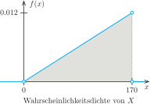

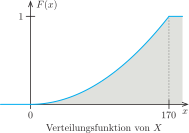

Radius beim Dartspiel: empirisch (oben, Histogramm und Verteilungsfunktion) und theoretisch (unten, Dichte und Verteilungsfunktion)
:::

| | Diskrete Zufallsvariable | Stetige Zufallsvariable |
|:--|:--|:--|
| Werte | Nimmt festgelegte Werte an: $X(\omega) \in \{x_1, x_2, \dots \}$, $x_i \in \mathbb{R}$ | Nimmt beliebige Werte an: $X(\omega) \in \mathbb{R}$ |
| Wahrscheinlichkeitsfunktion / Wahrscheinlichkeitsdichte | Wahrscheinlichkeit dafür, dass $X$ einen bestimmten Wert $x$ annimmt: $f(x) = P(X = x)$ | Wahrscheinlichkeit dafür, dass $X$ in einem Intervall $[a, b]$ liegt: $P(a \leq X \leq b) = \int_a^b f(x) \; dx$ |
| Verteilungsfunktion $F(x) = P(X \leq x)$: Wahrscheinlichkeit dafür, dass $X$ einen Wert kleiner gleich $x$ annimmt | $F(x) = \sum_{i : x_i \leq x} f(x_i)$ | $F(x) = \int_{-\infty}^x f(t) \; dt$ |
| Erwartungswert $\operatorname{E}(X)$: Wert, den die Zufallsvariable im Mittel annimmt, häufig auch mit $\mu$ bezeichnet | $\operatorname{E}(X) = \sum_{i} x_i f(x_i)$ | $\operatorname{E}(X) = \int_{-\infty}^{\infty} x \cdot f(x) \; dx$ |
| Varianz $\operatorname{Var}(X)$: Mittlere quadratische Abweichung vom Erwartungswert, Maß für die Streuung. Die Standardabweichung $\sigma$ ist die Wurzel aus der Varianz | $\operatorname{Var}(X) = \sum_{i} (x_i - \mu)^2 f(x_i)$ | $\operatorname{Var}(X) = \int_{-\infty}^\infty (x - \mu)^2 \cdot f(x) \; dx$ |

: Eigenschaften diskreter und stetiger Zufallsvariablen {#tbl-zufallsvariablen tbl-colwidths="[30,35,35]"}

## Verteilungen diskreter Zufallsvariablen {#sec-verteilungen-diskret}

### Bernoulli-Verteilung {#sec-bernoulli-verteilung}

::: beispiel
**Beispiel Pegel Hofkirchen:** Eine übliche Klassifikation von Hochwasserereignissen erfolgt anhand der sogenannten Jährlichkeit. So bezeichnet zum Beispiel die Durchflussmenge $\mathrm{HQ}_{10}$ einen Wert des Abflusses, der im Mittel in zehn Jahren einmal überschritten wird. Der Kehrwert dieser so genannten Jährlichkeit ist die Überschreitungswahrscheinlichkeit. Für das Zehn-Jahres-Hochwasser erhalten wir $p_{10} = 1/10 = 0.1$.

Für den Pegel Hofkirchen an der Donau gibt der Niedrigwasser-Informationsdienst Bayern den Wert $\mathrm{HQ}_{10} = 2700\,\mathrm{m^3/s}$ an. Wenn wir nun mit $\omega = (Q_1, Q_2, \dots, Q_{365})$ die Abflusswerte eines Jahres bezeichnen, dann ist die Funktion $X : \mathbb{R}^{365} \to \mathbb{R}$ mit
$$
X(\omega) =
\begin{cases}
0 & \text{falls } \max \omega < 2700 \\
1 & \text{falls } \max \omega \geq 2700
\end{cases}
$$
eine Zufallsvariable. Sie nimmt den Wert $1$ an, falls im betrachteten Jahr ein Abfluss von $2700\,\mathrm{m^3/s}$ überschritten wurde, und den Wert $0$, falls dies nicht der Fall war. Die Wahrscheinlichkeitsfunktion von $X$ können wir sofort angeben:
$$
f(x) = P(X = x) =
\begin{cases}
0.9 & \text{falls } x = 0 \\
0.1 & \text{falls } x = 1 \\
0 & \text{sonst}
\end{cases}
$$
Damit erhalten wir die nachfolgend dargestellten Realisierungen von $X$.

```{r}
#| fig-asp: 0.33

ggplot(d_hofkirchen) +
  geom_col(mapping = aes(x = Year, y = Qmax, fill = factor(X)), color = "black") +
  scale_fill_manual(values = c("0" = "light blue", "1" = "red"), name = TeX("$X(\\omega)$")) +
  labs(x = NULL)
```

Eine solche Zufallsvariable, die den Wert $1$ annimmt, falls ein Ereignis eintritt, und ansonsten den Wert $0$, heißt Bernoulli-Variable.
:::

::: {#def-bernoulli}
## Bernoulli-Variable

Für ein Ereignis $A \subset \Omega$, das mit einer Wahrscheinlichkeit von $P(A) = p$ eintritt, heißt die Zufallsvariable $X : \Omega \to \{0, 1\}$ mit
$$
X(\omega) =
\begin{cases}
1 & \text{falls } \omega \in A \; (A \text{ tritt ein}) \\
0 & \text{sonst}
\end{cases}
$$
[Bernoulli-Variable]{.neuerbegriff}. Die zugehörige Wahrscheinlichkeitsfunktion
$$
f(x) =
\begin{cases}
1-p & \text{für } x = 0 \\
p & \text{für } x = 1 \\
0 & \text{sonst}
\end{cases}
$$
wird [Bernoulli-Verteilung]{.neuerbegriff} genannt.

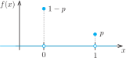{width=40%}
:::

Erwartungswert und Varianz lassen sich leicht bestimmen (Übungsaufgabe).

### Binomialverteilung

::: beispiel
**Fortsetzung Beispiel Pegel Hofkirchen:** In der Darstellung der jährlichen Maximalwerte ist aufgefallen, dass in drei Fällen innerhalb von fünf Jahren der Durchfluss $\mathrm{HQ}_{10}$ zweimal überschritten wurde. Wie wahrscheinlich ist das? Wir betrachten also das Ereignis $B$, dass in fünf willkürlich herausgegriffenen aufeinanderfolgenden Jahren in zwei Jahren der Abfluss $\mathrm{HQ}_{10}$ überschritten wird.

Hierzu definieren wir einen neuen Zufallsvorgang: Es werden in fünf aufeinanderfolgenden Jahren die Abflusswerte betrachtet. In jedem Jahr wird entweder der Abfluss $\mathrm{HQ}_{10}$ überschritten (bezeichnet mit $A$) oder nicht (bezeichnet mit $\bar{A}$). Ein Ergebnis mit zwei Überschreitungsjahren ist dann beispielsweise $\omega = (AA\bar{A}\bar{A}\bar{A})$. Wir wollen nun annehmen, dass Hochwasserereignisse in zwei aufeinanderfolgenden Jahren nicht korreliert sind. Dann ist die Wahrscheinlichkeit gleich dem Produkt der Einzelwahrscheinlichkeiten und es gilt
$$
P(AA\bar{A}\bar{A}\bar{A})
= P(A)\cdot P(A)\cdot P(\bar{A})\cdot P(\bar{A})\cdot P(\bar{A})
= 0.1^2 \cdot (1-0.1)^3
= 0.00729
$$
(es gilt $P(A) = 0.1$ und $P(\bar A) = 0.9$). Natürlich gibt es noch andere Ergebnisse mit zwei Überschreitungsjahren, etwa
$$
P(A\bar{A}\bar{A}\bar{A}A)
= P(A)\cdot P(\bar{A})\cdot P(\bar{A})\cdot P(\bar{A})\cdot P(A)
= 0.1 \cdot (1-0.1)^3 \cdot 0.1
= 0.00729.
$$
Offensichtlich hängt die Wahrscheinlichkeit nur von der Anzahl der Überschreitungsjahre ab und nicht davon, wie diese verteilt sind. Damit ist die gesuchte Wahrscheinlichkeit für zwei Überschreitungsjahre
$$
P(B) = P(AA\bar{A}\bar{A}\bar{A}) + P(A\bar{A}\bar{A}\bar{A}A) + \dots + P(\bar{A}\bar{A}\bar{A}AA) = C \cdot 0.00729,
$$
wobei $C$ die Anzahl der Möglichkeiten ist, wie sich die fünf Objekte $A, A, \bar A, \bar A, \bar A$ anordnen lassen. Wir erhalten das Schema
$$
\begin{array}{cc@{\qquad}cc@{\qquad}cc@{\qquad}cc}
AA\bar{A}\bar{A}\bar{A} & (1,2) &
A\bar{A}A\bar{A}\bar{A} & (1,3) &
A\bar{A}\bar{A}A\bar{A} & (1,4) &
A\bar{A}\bar{A}\bar{A}A & (1,5)
\\[1ex]
\bar{A}AA\bar{A}\bar{A} & (2,3) &
\bar{A}A\bar{A}A\bar{A} & (2,4) &
\bar{A}A\bar{A}\bar{A}A & (2,5) &
\\[1ex]
\bar{A}\bar{A}AA\bar{A} & (3,4) &
\bar{A}\bar{A}A\bar{A}A & (3,5) &
\\[1ex]
\bar{A}\bar{A}\bar{A}AA & (4,5) &
\end{array}
$$
und damit insgesamt $C = 10$ Möglichkeiten. Man kann sich auch überlegen, dass die Positionen der beiden Objekte $A$ durch Zahlen zwischen 1 und 5 beschrieben werden (Zahlen in Klammern). Dann entspricht die Anzahl der möglichen Anordnungen der Anzahl der Möglichkeiten, wenn aus einer Urne mit fünf Kugeln zwei gezogen werden und die Reihenfolge dabei keine Rolle spielt. Damit ist
$$
C = \binom{5}{2} = \frac{5!}{2!(5-2)!} = \frac{120}{2 \cdot 6} = 10
$$
und die Wahrscheinlichkeit für zwei Zehn-Jahres-Hochwasser in fünf Jahren liegt bei
$$
P(B) = 10 \cdot 0.00729 = 0.0729.
$$
:::

Dieses Ergebnis können wir verallgemeinern. Wir betrachten einen sich $n$-mal wiederholenden Zufallsvorgang, für den ein Ereignis $A$ mit der Wahrscheinlichkeit $p$ eintritt. Die Wahrscheinlichkeiten für die Wiederholungen seien stochastisch unabhängig. Dann ist die Anzahl der Durchführungen, bei denen $A$ eintritt, eine Zufallsvariable $X$, die ganzzahlige Werte $x$ zwischen $0$ und $n$ annehmen kann. Die Wahrscheinlichkeit dafür, dass $X$ den Wert $x$ annimmt, ist
$$
P(X = x) = C \cdot p^x \cdot (1-p)^{n-x}.
$$
Der Wert setzt sich zusammen aus:

- Der Anzahl der Kombinationsmöglichkeiten $C$ für $x$-mal $A$ und $(n-x)$-mal $\bar A$. Wir haben uns überlegt, dass dies dem Ziehen von $x$ aus $n$ Kugeln ohne Zurücklegen und ohne Berücksichtigung der Reihenfolge entspricht. Es gilt also
    $$
    C = \binom{n}{x}.
    $$

- Der Wahrscheinlichkeit $p^x$ dafür, dass $A$ in $x$ Durchführungen eintritt.

- Der Wahrscheinlichkeit $(1-p)^{n-x}$ dafür, dass das Gegenereignis $\bar A$ in den anderen $n-x$ Durchführungen eintritt.

Die Verteilung einer solchen Zufallsvariablen heißt wegen des darin auftretenden Binomialkoeffizienten Binomialverteilung.

::: {#def-binomialverteilung}
## Binomialverteilung

Eine diskrete Zufallsvariable $X$ heißt [binomialverteilt]{.neuerbegriff} mit den Parametern $n$ und $p$, kurz $X \sim B(n, p)$, wenn sie die Wahrscheinlichkeitsfunktion
$$
f(x) =
\begin{cases}
\displaystyle \binom{n}{x} p^x(1-p)^{n-x} & \text{für } x \in \{0, 1, \dots, n\} \\[1.5em]
0 & \text{sonst}
\end{cases}
$$
besitzt. Sie ergibt sich, wenn aus $n$ unabhängigen Wiederholungen eines Bernoulli-Vorgangs mit konstanter Wahrscheinlichkeit $p$ die Summe der Treffer gebildet wird.

Erwartungswert und Varianz einer binomialverteilten Zufallsvariablen sind
$$
\operatorname{E}(X) = n \cdot p
\quad \text{und} \quad
\operatorname{Var}(X) = n \cdot p \cdot (1 - p).
$$
:::

Es liegt nahe, dass bei einer kleinen Wahrscheinlichkeit von $A$ kleine Werte von $x$ wahrscheinlicher sind als große ($A$ tritt selten ein) und umgekehrt. Ist hingegen $A$ gleich wahrscheinlich wie $\bar A$, dann ist eine symmetrische Verteilung mit einem Maximum bei $n/2$ zu erwarten. Diese Zusammenhänge sind auch in dem Plot in @fig-binomialverteilung-beispiel klar zu erkennen.

```{r}
#| label: fig-binomialverteilung-beispiel
#| fig-cap: "Wahrscheinlichkeitsfunktion der Binomialverteilung für $n = 30$ und verschiedene Werte von $p$"

x <- 0:30
df <- tibble(
  x = x,
  p02 = dbinom(x, length(x) - 1, 0.2),
  p05 = dbinom(x, length(x) - 1, 0.5),
  p08 = dbinom(x, length(x) - 1, 0.8)
) |>
  gather(key = "p", value = "p_i", -x)

ggplot(data = df) +
  geom_col(mapping = aes(x = x, y = p_i, fill = p), position = "dodge", color = "black") +
  scale_fill_brewer(type = "qual", name = NULL, labels = c("p = 0.2", "p = 0.5", "p = 0.8")) +
  scale_x_continuous(minor_breaks = 0:30) +
  labs(y = "f(x)")
```

### Weitere diskrete Verteilungen

Hier noch drei weitere häufig verwendete diskrete Verteilungen:

- Hypergeometrische Verteilung $X \sim H(n, M, N)$, Qualitätskontrolle
    $$
    f(x) =
    \begin{cases}
    \dfrac{\binom{M}{x} \binom{N-M}{n-x}}{\binom{N}{n}} & \text{für } x = 0, 1, \dots, n \\
    0 & \text{sonst}
    \end{cases}
    $$

- Poisson-Verteilung $X \sim Po(\lambda)$, Anzahl von Ereignissen bei konstanter Rate
    $$
    f(x) =
    \begin{cases}
    \dfrac{\lambda^x}{x!}e^{-\lambda} & \text{für } x = 0, 1, 2, \dots \\[1em]
    0 & \text{sonst}
    \end{cases}
    \qquad
    \lambda > 0
    $$

- Geometrische Verteilung $X \sim G(p)$, Wartezeitprobleme
    $$
    f(x) =
    \begin{cases}
    (1-p)^{x-1}p & \text{für } x = 1, 2, \dots \\[1em]
    0 & \text{sonst}
    \end{cases}
    \qquad
    0 < p < 1
    $$

## Verteilungen stetiger Zufallsvariablen

### Berechnung von Kenngrößen in R

Wenn von einer Zufallsvariablen Dichte $f$ und Verteilungsfunktion $F$ gegeben sind, dann interessiert man sich in der Regel für die folgenden Größen:

1. Wert der Dichte $f(x)$: Wie groß ist die Wahrscheinlichkeitsdichte für den Wert $x$?

1. Wert der Verteilungsfunktion $p = F(x)$: Wie groß ist die Wahrscheinlichkeit $p$, dass der Wert $x$ nicht überschritten wird?

1. Quantilwert $x = F^{-1}(p)$: Welcher Wert $x$ wird mit der Wahrscheinlichkeit $p$ nicht überschritten?

1. Realisierungen: Erzeugung von $n$ Pseudozufallszahlen entsprechend der Verteilung der Variablen.

In R werden diese Werte nach dem folgenden Schema berechnet:

| | | |
|--:|:--|:--|
| Dichte | `dDIST(x, PARAMS)` | (`d` = *density*) |
| Verteilung | `pDIST(x, PARAMS)` | (`p` = *probability*) |
| Quantilwert | `qDIST(p, PARAMS)` | (`q` = *quantile*) |
| Realisierungen | `rDIST(n, PARAMS)` | (`r` = *random*) |

Dabei steht `DIST` für den Namen der Verteilung und `PARAMS` für die Parameter, mit denen die Verteilung beschrieben wird.

### Gleichverteilung

Siehe Übungsaufgabe.

Gleichverteilung in R:

| | |
|--:|:--|
| Dichte | `dunif(x, min = x1, max = x2)` |
| Verteilung | `punif(x, min = x1, max = x2)` |
| Quantilwert | `qunif(p, min = x1, max = x2)` |
| Realisierungen | `runif(n, min = x1, max = x2)` |

### Normalverteilung

Eine der wichtigsten Verteilungen für stetige Zufallsvariablen überhaupt ist die Gaußsche Normalverteilung, die wir bereits im Kapitel über Dichtekurven kennengelernt haben. Anwendungen:

- Messtechnik (Streuung der Messfehler)

- Streuung von Materialeigenschaften

- Zufällige Abweichungen bei der Fertigung von Werkstücken

- Beschreibung der brownschen Molekularbewegung

- Versicherungsmathematik

- …

Darüber hinaus ist die Normalverteilung in der schließenden Statistik von fundamentaler Bedeutung.

::: {#def-normalverteilung}
## Normalverteilung

Eine Zufallsvariable $X$ heißt [normalverteilt]{.neuerbegriff} mit den Parametern $\mu \in \mathbb{R}$ und $\sigma^2 > 0$, kurz $X \sim N(\mu, \sigma^2)$, wenn sie die Dichte
$$
f(x) = \frac{1}{\sigma \sqrt{2\pi}} \exp \left(-\frac{1}{2} \left(\frac{x-\mu}{\sigma}\right)^2 \right)
$$
besitzt. Dabei gilt
$$
\operatorname{E}(X) = \mu
\quad \text{und} \quad
\operatorname{Var}(X) = \sigma^2.
$$
Die Normalverteilung heißt auch Gauß-Verteilung und die Dichtekurve wird auch als Gauß-Kurve oder Gaußsche Glockenkurve bezeichnet.

Speziell für $\mu = 0$ und $\sigma = 1$ erhält man die Standardnormalverteilung $N(0, 1)$ mit der Dichte
$$
\phi(x) = \frac{1}{\sqrt{2\pi}} \exp \left(-\frac{1}{2} x^2 \right).
$$
:::

```{r}
#| label: fig-normalverteilung
#| fig-cap: "Dichte (oben) und Verteilungsfunktion (unten) für Normalverteilungen mit $\\mu = -2, \\sigma^2 = 4$ (links), $\\mu = 0, \\sigma^2 = 1$ (Mitte) und $\\mu = 2, \\sigma^2 = 1/4$ (rechts)"
#| fig-asp: 0.5

x1 <- -8
x2 <- 4

d <- tibble(
  x = seq(from = x1, to = x2, by = 0.01),
  f1 = dnorm(x, mean = -2, sd = 2),
  f2 = dnorm(x, mean = 0, sd = 1),
  f3 = dnorm(x, mean = 2, sd = 1 / 2),
  g1 = pnorm(x, mean = -2, sd = 2),
  g2 = pnorm(x, mean = 0, sd = 1),
  g3 = pnorm(x, mean = 2, sd = 1 / 2)
) |>
  gather(key = a, value = b, -x)

ggplot(data = d) +
  geom_line(mapping = aes(x = x, y = b)) +
  geom_ribbon(mapping = aes(x = x, ymax = b, ymin = 0), fill = "light blue", alpha = 0.5) +
  scale_x_continuous(breaks = c(-8, -4, 0, 4)) +
  scale_y_continuous(breaks = seq(0, 1, by = 0.2)) +
  labs(x = NULL, y = NULL) +
  theme(
    strip.background = element_blank(),
    strip.text.x = element_blank()
  ) +
  facet_wrap(~a)
```

Normalverteilung in R:

| | |
|--:|:--|
| Dichte | `dnorm(x, mean = mu, sd = sigma)` |
| Verteilung | `pnorm(x, mean = mu, sd = sigma)` |
| Quantilwert | `qnorm(p, mean = mu, sd = sigma)` |
| Realisierungen | `rnorm(n, mean = mu, sd = sigma)` |

Wichtig: In R wird die Standardabweichung $\sigma$ und nicht die Varianz $\sigma^2$ angegeben.

::: beispiel
**Beispiel Geschwindigkeitsmessung:** Eine Geschwindigkeitsmessung ergab eine mittlere Geschwindigkeit von $\bar{x} = 80\,\mathrm{km/h}$ mit einer empirischen Standardabweichung von $\tilde s = 10\,\mathrm{km/h}$. Die empirische Häufigkeitsverteilung legt nahe, dass die Daten annähernd normalverteilt sind. Damit ist die Geschwindigkeit eine Zufallsvariable $X \sim N(\mu = 80, \sigma^2 = 100)$. Das Beispiel ist aus @herz entnommen.

Wir stellen uns nun die folgenden Fragen:

1. Welche Geschwindigkeit $x_1$ wird mit einer Wahrscheinlichkeit von $0.15$ unterschritten?

    Lösung: Für die Geschwindigkeit $x_1$ muss gelten
    $$
    P(X \leq x_1 ) = F(x_1) = 0.15
    \iff
    x_1 = F^{-1}(0.15) = 69.6\,\mathrm{km/h},
    $$
    wobei der Zahlenwert in R mit `qnorm(0.15, mean = 80, sd = 10)` berechnet wurde.

1. Welche Geschwindigkeit $x_2$ wird mit einer Wahrscheinlichkeit von $0.15$ überschritten?

    Lösung: Es handelt sich hier um das Gegenereignis zur Geschwindigkeit, die von einem Anteil von $1-0.15 = 0.85$ der Verkehrsteilnehmer eingehalten wird (die 85 %-Geschwindigkeit), also
    $$
    P(X > x_2) = 1 - P(X \leq x_2) = 1 - F(x_2) = 0.15 \iff F(x_2) = 0.85
    $$
    und somit
    $$
    x_2 = F^{-1}(0.85) = 90.4\,\mathrm{km/h}.
    $$
    In R wird dieser Wert mit `qnorm(0.85, mean = 80, sd = 10)` berechnet.

1. Besonders schnelle und besonders langsame Fahrzeuge sollen zu gleichen Teilen unberücksichtigt bleiben. In welchen Bereich fallen die verbleibenden 95 % aller Geschwindigkeiten?

    Lösung: Gesucht ist der Wert $x_3$, so dass
    $$
    P(\mu - x_3 \leq X \leq \mu + x_3) = 0.95
    \quad \text{und} \quad
    P(X < \mu - x_3) = P(X > \mu + x_3)
    $$
    gilt. Mit
    $$
    P(X < \mu - x_3) = F(\mu - x_3) = 0.025
    \iff
    \mu - x_3 = F^{-1}(0.025) = 60.4\,\mathrm{km/h}
    $$
    erhalten wir
    $$
    x_3 = 19.6\,\mathrm{km/h}
    $$
    und damit den Geschwindigkeitsbereich von
    $$
    60.4\,\mathrm{km/h} \leq X \leq 99.6\,\mathrm{km/h}.
    $$

1. Es sollen nur Fahrzeuge analysiert werden, die nicht schneller als 100 km/h fahren. Welche Geschwindigkeit wird von 90 % dieser Fahrzeuge nicht unterschritten?

    Lösung: Die Bestimmungsgleichung für die gesuchte Geschwindigkeit $x_4$ lautet
    $$
    P(x_4 \leq X \leq 100) = 0.9 \cdot P(X \leq 100).
    $$
    Mit dem Anteil von
    $$
    0.9 \cdot P(X \leq 100) = 0.9 \cdot F(100)
    $$
    und
    $$
    P(x_4 \leq X \leq 100) = P(X \leq 100) - P(X \leq x_4) = F(100) - F(x_4) = 0.9 \cdot F(100)
    $$
    erhalten wir
    $$
    F(x_4) = (1 - 0.9) \cdot F(100)
    \iff
    x_4 = F^{-1}(0.1 \cdot F(100)) = 67.1\,\mathrm{km/h}.
    $$
    Der gesuchte Wert berechnet sich in R mit `qnorm(0.1 * pnorm(100, mean = 80, sd = 10), mean = 80, sd = 10)`.
:::

#### Zentraler Grenzwertsatz

::: beispiel
**Beispiel Mittelwerte gleichverteilter Werte:** Wir betrachten einen Datensatz mit 5000000 Werten, die zwischen $-1$ und $1$ gleichverteilt sind. Daraus wird ein neuer Datensatz erzeugt, indem jeweils aus $n$ Werten der Stichprobe der Mittelwert gebildet wird. Die drei Abbildungen zeigen die Histogramme der auf diese Art erzeugten Daten für $n = 2$, $n = 3$ und $n = 10$.

```{r}
#| fig-asp: 0.25
#| cache: true

n <- 5000000
d <- tibble(i = 1:n, x = runif(n, -1, 1))

doit <- function(g) {
  d2 <- d |>
    mutate(g = i %/% g) |>
    group_by(g) |>
    summarise(x = mean(x))
  ggplot(data = d2) +
    geom_histogram(
      mapping = aes(x = x, y = after_stat(density)),
      boundary = 0, binwidth = 0.02, fill = "orange"
    ) +
    coord_cartesian(xlim = c(-1, 1)) +
    scale_x_continuous(breaks = -1:1) +
    scale_y_continuous(breaks = 0:2) +
    labs(x = NULL, y = NULL, title = sprintf("n = %i", g))
}

doit(2) + doit(3) + doit(10)
```

Scheinbar nähert sich die Verteilung für wachsende Werte der Gruppengröße $n$ einer Normalverteilung an. Genau das ist die Aussage des zentralen Grenzwertsatzes.
:::

**Zentraler Grenzwertsatz:** Es seien $X_1, X_2, \dots, X_n$ unabhängige und identisch verteilte Zufallsvariablen mit
$$
\operatorname{E}(X_i) = \mu \quad \text{und} \quad \operatorname{Var}(X_i) = \sigma^2, \quad i = 1, \dots, n.
$$
Dann konvergiert die Verteilungsfunktion $F_n(z) = P(Z_n \leq z)$ der standardisierten Summe
$$
Z_n
= \frac{X_1 + X_2 + \dots + X_n - n \mu}{\sqrt{n} \sigma}
= \frac{1}{\sqrt{n}}\sum_{i=1}^n \frac{X_i - \mu}{\sigma}
$$
für $n \to \infty$ an jeder Stelle gegen die Verteilungsfunktion $\Phi$ der Standardnormalverteilung.

Etwas vereinfacht ausgedrückt heißt das: Die Summe vieler identischer Zufallsvariablen ist annähernd normalverteilt. Dieser Zusammenhang unterstreicht nochmals die herausragende Bedeutung der Normalverteilung.

### Logarithmische Normalverteilung

Eine einfache Möglichkeit zur Modellierung von linkssteilen Verteilungen ist die logarithmische Normalverteilung.

::: {#def-lognormalverteilung}
## Logarithmische Normalverteilung

Eine nichtnegative Zufallsvariable $X$ heißt [logarithmisch normalverteilt]{.neuerbegriff} mit den Parametern $\mu$ und $\sigma^2$, wenn die transformierte Variable $Y = \ln X$ mit $\mu$ und $\sigma^2$ normalverteilt ist. Dabei gilt
$$
\operatorname{E}(X) = \exp(\mu + \sigma^2/2)
\quad \text{und} \quad
\operatorname{Var}(X) = \exp(2\mu + \sigma^2)(\exp(\sigma^2)-1).
$$
:::

In @fig-lognormal-f sind die Dichtefunktionen von logarithmisch normalverteilten Zufallsvariablen mit unterschiedlichen Parametern dargestellt.

```{r}
#| label: fig-lognormal-f
#| fig-cap: Dichtekurven von logarithmischen Normalverteilungen
#| fig-asp: 0.5

n <- 1500

d <- tibble(
  x = seq(from = -1, to = 5, length.out = n),
  f1 = dlnorm(x, mean = 0, sd = 1),
  f2 = dlnorm(x, mean = 0, sd = 0.25),
  f3 = dlnorm(x, mean = -1, sd = 1),
  f4 = dlnorm(x, mean = 1, sd = 1)
) |>
  gather(key = "a", value = "b", -x)

ggplot(data = d) +
  geom_line(mapping = aes(x = x, y = b, color = a)) +
  scale_color_discrete(
    name = NULL,
    labels = c(
      "μ =  0, σ = 1",
      "μ =  0, σ = 1/4",
      "μ = -1, σ = 1",
      "μ =  1, σ = 1"
    )
  ) +
  labs(y = "f(x)")
```

Lognormal-Verteilung in R:

| | |
|--:|:--|
| Dichte | `dlnorm(x, mean = 0, sd = 1)` |
| Verteilung | `plnorm(x, mean = 0, sd = 1)` |
| Quantilwert | `qlnorm(p, mean = 0, sd = 1)` |
| Realisierungen | `rlnorm(n, mean = 0, sd = 1)` |

### Weibull-Verteilung

Vielfältige Anwendungen in den Ingenieurwissenschaften besitzt die Weibull-Verteilung. Sie wird unter anderem zur Modellierung von Windgeschwindigkeiten und zur Beschreibung der Lebensdauer von Bauteilen verwendet.

::: {#def-weibull-verteilung}
## Weibull-Verteilung

Eine Zufallsvariable $X$ mit der Dichte
$$
f(x) = \lambda \cdot k \cdot (\lambda \cdot x)^{k-1} \exp\left(-(\lambda \cdot x)^k\right)
$$
mit den Parametern $\lambda, k > 0$ heißt [Weibull-verteilt]{.neuerbegriff}. Der Erwartungswert ist
$$
\operatorname{E}(X) = \frac{1}{\lambda} \cdot \Gamma\left(1 + \frac{1}{k} \right),
$$
die Varianz
$$
\operatorname{Var}(X) = \frac{1}{\lambda^2} \left(\Gamma\left(1+\frac{2}{k}\right) - \Gamma^2\left(1+\frac{1}{k}\right)\right).
$$
Dabei bezeichnet $\Gamma$ die Gamma-Funktion.
:::

@fig-weibull-f zeigt die Dichtefunktionen verschiedener Weibull-Verteilungen.

```{r}
#| label: fig-weibull-f
#| fig-cap: Dichtekurven von Weibull-verteilten Zufallsvariablen
#| fig-asp: 0.5

n <- 1500

d <- tibble(
  x = seq(from = 0, to = 2.5, length.out = n),
  f1 = dweibull(x, shape = 1 / 2, scale = 1),
  f2 = dweibull(x, shape = 1, scale = 1),
  f3 = dweibull(x, shape = 3 / 2, scale = 1),
  f4 = dweibull(x, shape = 5, scale = 1)
) |>
  gather(key = "a", value = "b", -x)

ggplot(data = d) +
  geom_line(mapping = aes(x = x, y = b, color = a)) +
  scale_color_discrete(
    name = NULL,
    labels = c(
      "λ = 1, k = 0.5",
      "λ = 1, k = 1",
      "λ = 1, k = 1.5",
      "λ = 1, k = 5"
    )
  ) +
  coord_cartesian(ylim = c(0, 2)) +
  labs(y = "f(x)")
```

Weibull-Verteilung in R:

| | |
|--:|:--|
| Dichte | `dweibull(x, shape = k, scale = 1/lambda)` |
| Verteilung | `pweibull(x, shape = k, scale = 1/lambda)` |
| Quantilwert | `qweibull(p, shape = k, scale = 1/lambda)` |
| Realisierungen | `rweibull(n, shape = k, scale = 1/lambda)` |

### Chi-Quadrat-, Student- und Fisher-Verteilung

Es handelt sich hier um eine Familie von verwandten Verteilungen, die insbesondere in der schließenden Statistik benötigt werden.

#### Die Chi-Quadrat-Verteilung

Viele Teststatistiken besitzen unter geeigneten Voraussetzungen zumindest approximativ eine Chi-Quadrat-Verteilung. Diese ergibt sich aus der Addition der Quadrate von $n$ standardnormalverteilten Zufallsvariablen.

::: {#def-chi-quadrat-verteilung}
## $\chi^2$-Verteilung

Seien $X_1, X_2, \dots, X_n$ unabhängige standardnormalverteilte Zufallsvariablen. Dann heißt die Verteilung der Zufallsvariablen
$$
Z = X^2_1 + X^2_2 + \dots + X^2_n
$$
[Chi-Quadrat-Verteilung]{.neuerbegriff} mit $n$ Freiheitsgraden. Die Zufallsvariable $Z$ heißt dann $\chi^2(n)$-verteilt und man schreibt kurz $Z \sim \chi^2(n)$. Für den Mittelwert und die Varianz gilt
$$
\operatorname{E}(Z) = n \quad \text{und} \quad \operatorname{Var}(Z) = 2n.
$$
:::

In @fig-chi-quadrat-f sind für verschiedene Freiheitsgrade $n$ die Dichtekurven dargestellt. Für kleine $n$ sind die Verteilungen deutlich linkssteil, für wachsendes $n$ nähern sie sich einer Normalverteilung an, so wie uns das auch der zentrale Grenzwertsatz sagt.

```{r}
#| label: fig-chi-quadrat-f
#| fig-cap: Dichtekurven von $\chi^2$-Verteilungen
#| fig-asp: 0.5

n <- 1500

d <- tibble(
  x = seq(from = -1, to = 15, length.out = n),
  f2 = dchisq(x, df = 2),
  f3 = dchisq(x, df = 3),
  f5 = dchisq(x, df = 5),
  f8 = dchisq(x, df = 8)
) |>
  gather(key = "a", value = "b", -x)

ggplot(data = d) +
  geom_line(mapping = aes(x = x, y = b, color = a)) +
  scale_color_discrete(name = NULL, labels = c("n = 2", "n = 3", "n = 5", "n = 8")) +
  labs(y = "f(x)")
```

$\chi^2$-Verteilung in R:

| | |
|--:|:--|
| Dichte | `dchisq(x, df = n)` |
| Verteilung | `pchisq(x, df = n)` |
| Quantilwert | `qchisq(p, df = n)` |
| Realisierungen | `rchisq(n, df = n)` |

Dabei steht `df` für *degrees of freedom*, also die Anzahl der Freiheitsgrade $n$.

#### Die Student-Verteilung

Diese Verteilung findet insbesondere bei Parametertests und Konfidenzintervallen Anwendung. Sie wird häufig auch als Students $t$-Verteilung oder kurz $t$-Verteilung bezeichnet.

::: {#def-student-verteilung}
## Student-Verteilung

Seien $X \sim N(0, 1)$ und $Z \sim \chi^2(n)$ zwei unabhängige Zufallsvariablen. Dann heißt die Verteilung der Zufallsvariablen
$$
T = \frac{X}{\sqrt{Z/n}}
$$
[$t$-Verteilung]{.neuerbegriff} mit $n$ Freiheitsgraden, die Kurzschreibweise lautet $T \sim t(n)$. Dabei gilt
$$
\operatorname{E}(T) = 0 \;\; (n > 1)
\quad \text{und} \quad
\operatorname{Var}(T) = \frac{n}{n-2} \;\; (n > 2).
$$
:::

Wie @fig-student-t-f zeigt, ist die Dichte der $t$-Verteilung symmetrisch um null. Für kleineres $n$ sind die Enden im Vergleich zur Normalverteilung breiter. Die $t$-Verteilung eignet sich daher zur Modellierung von Daten, bei denen im Vergleich zur Normalverteilung ein größerer Anteil an extremen Werten enthalten ist. Für wachsende Werte von $n$ nähert sich die Verteilung der Standardnormalverteilung an.

```{r}
#| label: fig-student-t-f
#| fig-cap: Dichtekurven von Student-$t$-Verteilungen
#| fig-asp: 0.5

n <- 1500

d <- tibble(
  x = seq(from = -5, to = 5, length.out = n),
  f01 = dt(x, df = 1),
  f02 = dt(x, df = 2),
  f05 = dt(x, df = 5),
  f20 = dt(x, df = 20)
) |>
  gather(key = "a", value = "b", -x)

ggplot(data = d) +
  geom_line(mapping = aes(x = x, y = b, color = a)) +
  scale_color_discrete(name = NULL, labels = c("n = 1", "n = 2", "n = 5", "n = 20")) +
  labs(y = "f(x)")
```

$t$-Verteilung in R:

| | |
|--:|:--|
| Dichte | `dt(x, df = n)` |
| Verteilung | `pt(x, df = n)` |
| Quantilwert | `qt(p, df = n)` |
| Realisierungen | `rt(n, df = n)` |

Dabei steht `df` für *degrees of freedom*, also die Anzahl der Freiheitsgrade $n$.

#### Fisher-Verteilung

Für einige Testverfahren der Regressions- und Varianzanalyse benötigt man die Fisher-Verteilung.

::: {#def-fisher-verteilung}
## Fisher-Verteilung

Seien $X \sim \chi^2(m)$ und $Y \sim \chi^2(n)$ zwei voneinander unabhängige $\chi^2$-verteilte Zufallsvariablen. Dann wird die Verteilung der Zufallsvariablen
$$
Z = \frac{X/m}{Y/n}
$$
[Fisher-Verteilung]{.neuerbegriff} oder F-Verteilung mit den Freiheitsgraden $m$ und $n$ genannt. Man schreibt dafür $Z \sim F(m, n)$. Es gilt dabei
$$
\operatorname{E}(Z) = \frac{n}{n-2} \;\; (n > 2)
\quad \text{und} \quad
\operatorname{Var}(Z) = \frac{2n^2(n+m-2)}{m(n-4)(n-2)^2} \;\; (n > 4).
$$
:::

@fig-fisher-f zeigt für verschiedene Werte von $m$ und $n$ die Dichtekurven der Fisher-Verteilung.

```{r}
#| label: fig-fisher-f
#| fig-cap: Dichtekurven von Fisher-Verteilungen
#| fig-asp: 0.5

n <- 1500

d <- tibble(
  x = seq(from = -1, to = 5, length.out = n),
  f2 = df(x, df1 = 2, df2 = 10),
  f3 = df(x, df1 = 3, df2 = 100),
  f5 = df(x, df1 = 10, df2 = 10),
  f8 = df(x, df1 = 50, df2 = 50)
) |>
  gather(key = "a", value = "b", -x)

ggplot(data = d) +
  geom_line(mapping = aes(x = x, y = b, color = a)) +
  scale_color_discrete(
    name = NULL,
    labels = c("m = 2, n = 10", "m = 3, n = 100", "m = 10, n = 10", "m = 50, n = 50")
  ) +
  labs(y = "f(x)")
```

Fisher-Verteilung in R:

| | |
|--:|:--|
| Dichte | `df(x, df1 = m, df2 = n)` |
| Verteilung | `pf(x, df1 = m, df2 = n)` |
| Quantilwert | `qf(p, df1 = m, df2 = n)` |
| Realisierungen | `rf(n, df1 = m, df2 = n)` |

### Verteilungen für spezielle Probleme

Jede Funktion $f$, die auf ganz $\mathbb{R}$ definiert ist, keine negativen Werte annimmt und deren Graph mit der $x$-Achse einen Flächeninhalt von eins einschließt, kann als Dichtefunktion einer Zufallsvariablen dienen. Je nach der betrachteten Fragestellung können also geeignete Dichtefunktionen selber definiert werden, solange nur die entsprechenden Bedingungen erfüllt sind.

::: beispiel
**Beispiel Imperfektionen von Walzträgern:** Träger aus Walzprofilen werden nie exakt gerade gefertigt, es ist immer mit Imperfektionen zu rechnen. Eine Firma, die Walzprofile herstellt, garantiert für Träger einer Länge $l$ eine maximale Abweichung $d$ von der ideal geraden Geometrie. Dabei sind große Werte der Abweichung weniger wahrscheinlich als kleine Werte.

Wenn wir die Abweichung als Zufallsvariable auffassen, dann muss dementsprechend die Wahrscheinlichkeitsdichte für $x < -d$ und $x > d$ null sein und für $x = 0$ ihr Maximum annehmen. Denkbar ist also eine nach unten geöffnete Parabel für die Dichtefunktion.

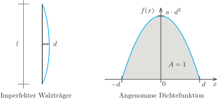{width=80%}

Die Gleichung der quadratischen Dichtefunktion können wir mithilfe der Linearfaktoren zu den beiden Nullstellen angeben. Mit $(x - d)(x + d) = x^2 - d^2$ erhalten wir die Funktion $f : \mathbb{R} \to \mathbb{R}$ mit
$$
f(x) =
\begin{cases}
0 & \text{für } x < -d \\
a (x^2 - d^2) & \text{für } -d \leq x \leq d \\
0 & \text{für } x > d
\end{cases}.
$$
Den Faktor $a$ bestimmen wir aus der Normierungseigenschaft
$$
\int_{-\infty}^{\infty} f(x) \; dx = 1
$$
der Dichtefunktion von Zufallsvariablen. Damit erhalten wir
$$
\begin{aligned}
\int_{-d}^d a (x^2 - d^2) \; dx
& = a \left[ \frac{1}{3}x^3 - d^2x \right]_{-d}^d \\
& = a \left( \frac{1}{3}d^3 - d^2d - \left(-\frac{1}{3}d^3 + d^2d\right) \right)
= -\frac{4}{3}a d^3 = 1,
\end{aligned}
$$
so dass
$$
a = -\frac{3}{4d^3}
$$
gelten muss. Damit ist
$$
f(x) =
\begin{cases}
0 & \text{für } x < -d \\
\frac{3}{4d^3} (d^2 - x^2) & \text{für } -d \leq x \leq d \\
0 & \text{für } x > d
\end{cases}
$$
die gesuchte Dichtefunktion. Mit
$$
\begin{aligned}
\int_{-d}^x \frac{3}{4d^3} (d^2 - t^2) \; dt
& = \frac{3}{4d^3} \left[ d^2 t - \frac{1}{3}t^3 \right]_{-d}^x \\
& = \frac{3}{4d^3}\left(d^2 x - \frac{1}{3}x^3 - \left(-d^3 + \frac{1}{3}d^3\right)\right)
= -\frac{x^3}{4 d^3}+\frac{3 x}{4 d}+\frac{1}{2}
\end{aligned}
$$
ergibt sich die zugehörige Verteilungsfunktion
$$
F(x) =
\begin{cases}
0 & \text{für } x < -d \\
\displaystyle -\frac{x^3}{4 d^3}+\frac{3 x}{4 d}+\frac{1}{2} & \text{für } -d \leq x \leq d \\[1ex]
1 & \text{für } x > d
\end{cases},
$$
die aufgrund der Stetigkeit von $f$ auf ganz $\mathbb{R}$ differenzierbar ist.
:::

## Rechenregeln für Zufallsvariablen

Ausgehend von existierenden Zufallsvariablen können durch eine lineare Transformation oder durch Addition neue Zufallsvariablen erzeugt werden. Erwartungswert und Varianz für diese neuen Variablen lassen sich leicht mit den hier vorgestellten Rechenregeln bestimmen. Diese gelten für diskrete und stetige Zufallsvariablen und werden ohne Beweis angegeben.

#### Lineare Transformation

Für eine Zufallsvariable $X : \Omega \to \mathbb{R}$ können wir mithilfe von zwei Zahlen $a, b \in \mathbb{R}$ eine neue Zufallsvariable $Z = a X + b$ mit $Z(\omega) = a X(\omega) + b$ definieren. Dann gilt
$$
\operatorname{E}(Z) = a \cdot \operatorname{E}(X) + b
\quad \text{und} \quad
\operatorname{Var}(Z) = a^2 \cdot \operatorname{Var}(X).
$$

#### Addition

Für zwei Zufallsvariablen $X, Y : \Omega \to \mathbb{R}$ ist $Z = X + Y$ mit $Z(\omega) = X(\omega) + Y(\omega)$ wieder eine Zufallsvariable. Für den Erwartungswert gilt dann immer
$$
\operatorname{E}(Z) = \operatorname{E}(X) + \operatorname{E}(Y).
$$
Sind die beiden Zufallsvariablen darüber hinaus unabhängig, dann gilt weiterhin
$$
\operatorname{Var}(Z) = \operatorname{Var}(X) + \operatorname{Var}(Y).
$$

::: beispiel
**Beispiel $Z = X + X$:** Für eine Zufallsvariable $X$ definieren wir $Z = X + X = 2X$. Wir können also den Erwartungswert sowohl mit der Formel für die lineare Transformation als auch mit der Rechenregel für die Addition ermitteln. Wir erhalten
$$
\operatorname{E}(Z) = 2 \operatorname{E}(X)
\quad \text{beziehungsweise} \quad
\operatorname{E}(Z) = \operatorname{E}(X) + \operatorname{E}(X),
$$
also das erwartete Ergebnis. Wenden wir die Rechenregel für die Varianz an, dann ergibt sich aus der Transformationsregel das korrekte Ergebnis
$$
\operatorname{Var}(Z) = 2^2 \cdot \operatorname{Var}(X) = 4 \cdot \operatorname{Var}(X).
$$
Wenn wir die Regel für die Addition anwenden, ist das Ergebnis hingegen
$$
\operatorname{Var}(X) + \operatorname{Var}(X) = 2 \cdot \operatorname{Var}(X) \neq \operatorname{Var}(Z).
$$
Dies liegt daran, dass die Voraussetzung für die Anwendung der Regel nicht erfüllt ist: Die Zufallsvariable $X$ ist natürlich nicht unabhängig von sich selbst. Die Regel darf daher nicht angewendet werden.
:::
