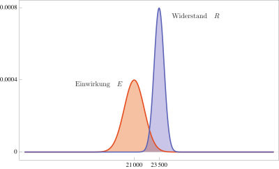
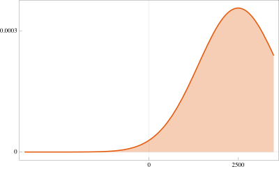

```{r}
#| include: false
source(rprojroot::is_quarto_project$find_file("_bcd-setup.R"))
```

# Zuverlässigkeit von Tragwerken

In der Planung von Tragwerken spielen eine Vielzahl von Unsicherheiten eine Rolle:

- Die Einwirkungen auf das Tragwerk sind zum Planungszeitpunkt nicht genau bekannt. Darüber hinaus können sich durch Nutzungsänderungen neue Beanspruchungssituationen ergeben, im Zuge des Klimawandels werden extreme Wetterereignisse und damit einhergehende außergewöhnliche Einwirkungen häufiger.

- Materialeigenschaften streuen mehr oder weniger stark, sie können sich über die Zeit verschlechtern (Schädigung) oder durch Umwelteinflüsse ändern (extreme Kälte, Hitze).

- Im Extremfall können Konstruktionen versagen, wenn diesen Unsicherheiten in der Planung nicht hinreichend Rechnung getragen wurde.

In der Praxis werden Unsicherheiten bei der Bemessung von Konstruktionen meist mithilfe von Sicherheitsbeiwerten berücksichtigt. Moderne Normen basieren dabei auf dem Teilsicherheitskonzept, in dem allen Einflussgrößen eigene Teilsicherheiten zugeordnet sind. Für den Grenzzustand der Tragfähigkeit ist dann zu zeigen, dass für einen Querschnitt oder ein Bauteil der Bemessungswert der Auswirkungen einer Einwirkung $E_\mathrm{d}$ kleiner gleich dem Bemessungswert des zugehörigen Tragwiderstands $R_\mathrm{d}$ ist. Es muss also
$$
E_\mathrm{d} \leq R_\mathrm{d}
$$
gelten.

::: {#fig-unsicherheiten layout="[[27,40,33]]"}
{height=40mm}

{height=45mm}

{height=40mm}

Unsichere Einwirkungen, Widerstände und Tragwerksversagen
:::

Eine genauere Betrachtung fragt hingegen nach der Wahrscheinlichkeit, mit der ein Versagen des Tragwerks eintritt. Dieser Fall tritt ein, wenn die Einwirkungen den Tragwiderstand überschreiten. Für ein gegebenes Tragwerk wird also versucht, die Versagenswahrscheinlichkeit
$$
P(\text{„Versagen"}) = P(E > R)
$$
zu bestimmen. Als Richtwert für eine von der Gesellschaft akzeptierte Versagenswahrscheinlichkeit wird häufig der Wert $1 / 1000000$ angegeben.

In der Praxis sind für ein Bauteil oder Tragwerk in der Regel mehrere Nachweise zu führen, wobei nochmal zwischen Tragfähigkeits- und Gebrauchstauglichkeitsnachweisen unterschieden wird. Ein entsprechendes Beispiel zeigt @fig-beurteilungsbasis.

![Beurteilungsbasis für einen Stahlbetonträger [aus @schneider_1996]](00-bilder/beurteilungsgrundlage.svg){#fig-beurteilungsbasis}

Die Eigenschaft einer Konstruktion, ihre Funktion während einer festgelegten Nutzungsdauer mit einer vorgegebenen Wahrscheinlichkeit zu erfüllen, wird [Zuverlässigkeit]{.neuerbegriff} genannt. Diese Wahrscheinlichkeit ergibt sich als Komplement zur Wahrscheinlichkeit, dass ein Versagen eintritt, zu
$$
P(\text{„Anforderungen erfüllt"}) = 1 - P(\text{„Versagen"}).
$$

## Berechnung von Versagenswahrscheinlichkeiten

Die Entwicklung von Methoden zur Bestimmung von Versagenswahrscheinlichkeiten für Tragkonstruktionen war (und ist es teilweise immer noch) Gegenstand weltweiter Forschungsaktivitäten. Es gibt unzählige Bücher, Fachzeitschriften und Tagungsbände zum Thema. Exemplarisch genannt seien die Standardwerke *Structural Reliability Methods* von O. Ditlevsen und H.O. Madsen [@ditlevsen_1996] sowie *Probability Concepts in Engineering* von A.H-S. Ang und W.H. Tang [@ang_2007]. Ebenfalls (bedingt) empfehlenswert ist das auf Deutsch erschienene Buch *Sicherheit und Zuverlässigkeit im Bauwesen* von J. Schneider [@schneider_1996], das darüber hinaus online frei verfügbar ist.

Die Grundidee bei der Berechnung von Versagenswahrscheinlichkeiten besteht darin, die im Tragsystem vorhandenen Unsicherheiten durch geeignete Zufallsvariablen zu erfassen. Damit werden Einwirkungen und Tragwiderstand selber zu Zufallsvariablen, auf deren Grundlage die Versagenswahrscheinlichkeit bestimmt werden kann. In einfachen Fällen gelingt das sogar auf dem Papier.

::: beispiel
**Beispiel Zugstab:** Wir betrachten einen Zugstab aus Baustahl S235 der Fläche $A = 100\,\mathrm{mm^2}$, an dem eine Kraft $F = 21000\,\mathrm{N}$ angreift.

{width=50%}

Mit der charakteristischen Fließspannung $f_y = 235\,\mathrm{N/mm^2}$ erhalten wir als Widerstand eine aufnehmbare Kraft von
$$
R = 235 \cdot 100 = 23500\,\mathrm{N},
$$
die größer ist als die Einwirkung $F$.

Wir wollen nun annehmen, dass es sich bei der Einwirkung $E$ (die Kraft $F$) und dem Widerstand $R$ um zufällige Größen handelt. Dabei soll es sich um normalverteilte Zufallsvariablen handeln, die durch folgende Kennwerte charakterisiert sind:

|     | $\mu$   | $\sigma$ |
|:---:|:-------:|:--------:|
| $E$ | 21000   | 1000     |
| $R$ | 23500   | 500      |

Für die zugehörigen Wahrscheinlichkeitsdichtefunktionen erhalten wir folgende Situation:

{width=70%}

Es gibt also einen Bereich, in dem beide Dichtefunktionen ungleich null sind (klar, die Normalverteilung ist überall größer als null), es ist also mit der Möglichkeit zu rechnen, dass die Einwirkung größer wird als der Widerstand und das Bauteil versagt. Mathematisch ausgedrückt heißt das:
$$
P(\text{„Versagen"}) = P(E > R) > 0.
$$
Um diese Wahrscheinlichkeit zu bestimmen, definieren wir eine neue Zufallsvariable
$$
G = R - E,
$$
die als [Grenzzustand]{.neuerbegriff} bezeichnet wird. Das System versagt, wenn die Einwirkung größer ist als der Widerstand. Damit gilt
$$
P(\text{„Versagen"}) = P(G < 0),
$$
die Wahrscheinlichkeit dafür, dass unser System versagt, entspricht damit der Wahrscheinlichkeit, dass der Grenzzustand einen Wert kleiner als null annimmt.

Entsprechend den Rechenregeln für Zufallsvariablen ist $G$ wiederum normalverteilt mit
$$
\mu_G = 23500 - 21000 = 2500\,\mathrm{N}
$$
sowie
$$
\sigma_G = \sqrt{1000^2 + 500^2} = 500 \sqrt{5} = 1118\,\mathrm{N}.
$$
Die zugehörige Dichtefunktion $f_G$ besitzt den Graphen

{width=50%}

Die Versagenswahrscheinlichkeit entspricht der Fläche unter dem Graphen von $f_G$ zwischen $-\infty$ und $0$, also
$$
P(\text{„Versagen"}) = \int_{-\infty}^0 f_G(x) \; dx = F_G(0) \approx 0.013.
$$
Der Zahlenwert wird mit dem Computer berechnet, zum Beispiel durch die R-Anweisung

```{r}
#| echo: true
pnorm(0, mean = 2500, sd = 1118)
```

Für sicherheitsrelevante Bauteile ist dieser Wert natürlich viel zu hoch.

Zu dem Ergebnis, dass der Zugstab nicht ausreichend dimensioniert ist, gelangen wir auch, wenn wir in dem Nachweis die entsprechenden Teilsicherheitsbeiwerte ansetzen. Für eine veränderliche Last $F$ erhalten wir mit
$$
E_d = 1.5 \cdot 21000 = 31500\,\mathrm{N} \quad \text{sowie} \quad
R_d = 23500 / 1.1 = 21363.6\,\mathrm{N}
$$
das Ergebnis
$$
\frac{E_d}{R_d} = \frac{31500}{21363.6} = 1.47 > 1.
$$
Der Nachweis ist nicht erfüllt.
:::

Auf diese einfache Art und Weise lassen sich Versagenswahrscheinlichkeiten nur in den allereinfachsten Fällen berechnen. Für praktisch relevante Aufgaben wurden verschiedene allgemeiner anwendbare Verfahren entwickelt. Besonders einfach zu verstehen ist die Monte-Carlo-Methode.

### Monte-Carlo-Methode

Die Grundidee der [Monte-Carlo-Methode]{.neuerbegriff} zur Ermittlung der Versagenswahrscheinlichkeit von Tragsystemen ist bestechend einfach:

1. Im Computer wird ein Tragwerksmodell erstellt (in der Regel mithilfe eines FE-Programms), das für gegebene Werte der zufälligen Größen $x_1, x_2, \dots, x_n$ den Wert der Grenzzustandsfunktion $G(x_1, x_2, \dots, x_n)$ berechnet.

1. Mithilfe von (Pseudo-)Zufallszahlen wird eine große Anzahl an Tragwerksberechnungen durchgeführt.

1. Die Anzahl der Berechnungen, in denen das System versagt (also $G(x_1, x_2, \dots, x_n) < 0$ berechnet wird), geteilt durch die gesamte Anzahl der Berechnungen ergibt eine Näherung für die gesuchte Versagenswahrscheinlichkeit.

Der große Vorteil dieser Methode ist, dass sie für alle Aufgabenstellungen funktioniert. Problematisch ist, dass eine sehr große Anzahl an Simulationsrechnungen durchgeführt werden muss. Der Aufwand steigt dabei mit der Anzahl der involvierten Zufallsvariablen und kleiner werdenden Versagenswahrscheinlichkeiten.

::: beispiel
**Fortsetzung Beispiel Zugstab:** Im Beispiel des Zugstabes können wir das einfach in R umsetzen, da für die Analyse des Tragwerks keine aufwändige Berechnung notwendig ist. Die Realisierungen des Tragsystems lassen sich mit folgender Anweisung erzeugen:

```{r}
#| echo: true
N <- 100000
d <- tibble(
  E = rnorm(N, mean = 21000, sd = 1000),
  R = rnorm(N, mean = 23500, sd = 500),
  G = R - E
)
```

Die Näherung der Versagenswahrscheinlichkeit erhält man dann mithilfe von

```{r}
#| echo: true
sum(d$G <= 0) / N
```

Der berechnete Wert ist dabei selber wieder die Realisierung einer Zufallsvariablen. Die zugehörige Varianz lässt sich recht einfach angeben, aber dieses Thema soll hier nicht weiter vertieft werden.
:::
